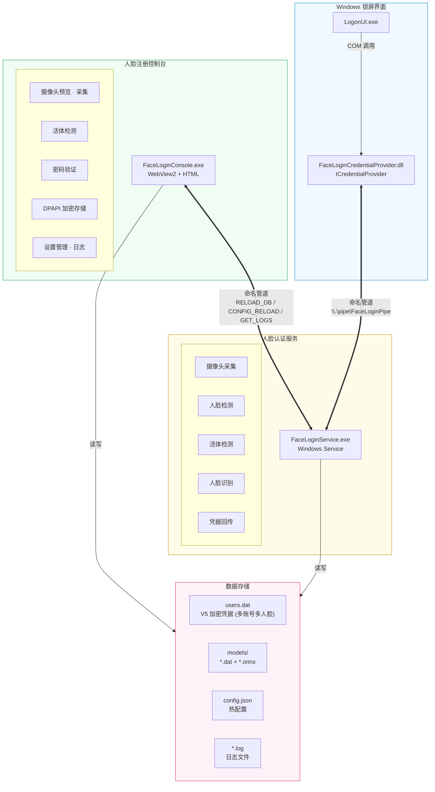
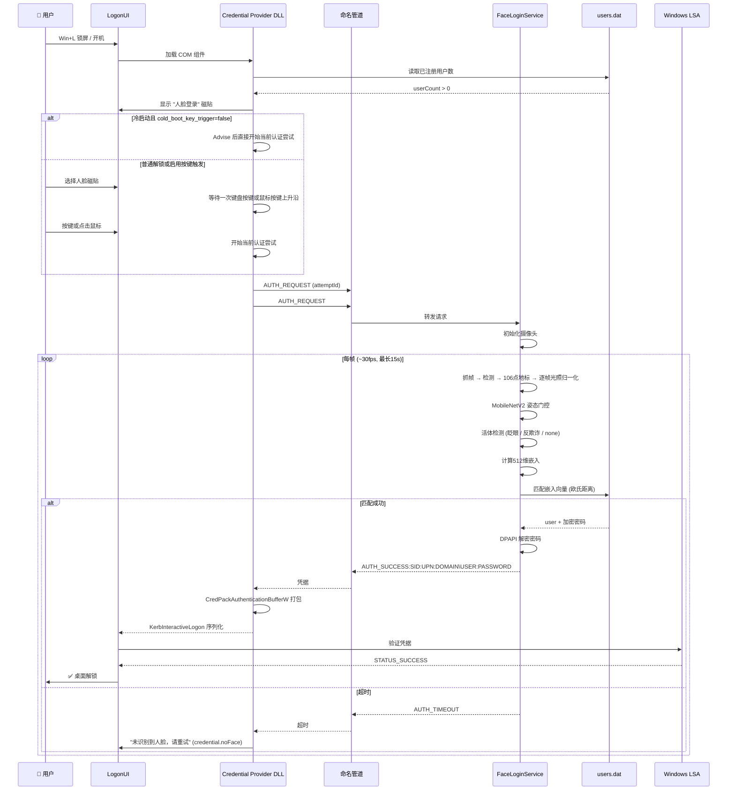
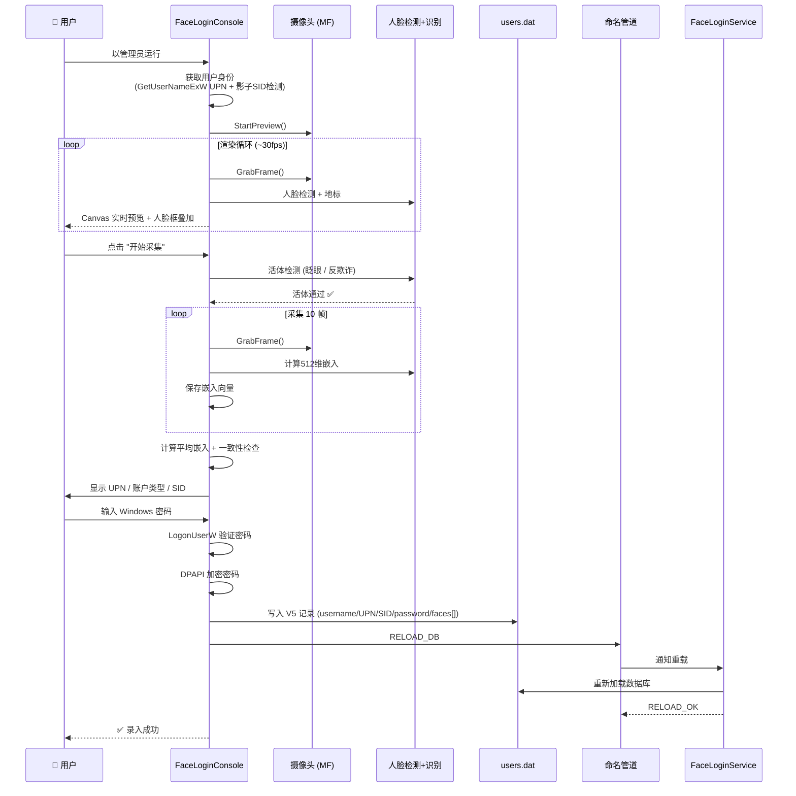

# FaceLogin 技术开发文档

本文档对应当前 `dev-2.0.0` 开发线（以 `v1.9.0` release 为基线）。如果文档与实现冲突，以当前源代码、`common/` 协议定义和构建脚本为准。

## 一、项目概述

### 1.1 项目简介

FaceLogin 是一个 Windows 人脸识别登录系统，允许用户通过摄像头人脸识别解锁 Windows 桌面。项目基于 Windows Credential Provider 框架实现锁屏/登录界面集成，使用 ONNX Runtime 进行人脸检测、地标提取、识别与活体检测。

### 1.2 技术栈

| 层面 | 技术 |
|---|---|
| 编程语言 | C++20, Go (安装程序) |
| 构建系统 | CMake 3.20+ |
| 包管理 | vcpkg |
| 人脸检测 | SCRFD ONNX |
| 地标提取 | 2d106det ONNX (106点) |
| 人脸识别 | InsightFace buffalo_s ONNX (512维) |
| 活体检测 | EAR眨眼检测 + facenox MiniFAS 静默反欺诈，可配置为 `blink` / `antispoof` / `none`（默认 `none`） |
| 相机采集 | Media Foundation 优先 + DirectShow 回退（服务与 Console 统一管线） |
| 光照处理 | 公共逐帧光照统计与归一化；硬件粗调可验证、会话级降级，用户开关默认关闭 |
| 头部姿态 | MobileNetV2 6D Pose ONNX，输出 Yaw / Pitch / Roll，用于锁屏识别姿态门控 |
| 多语言 | 独立语言包 locales/*.json（zh-CN / ko-KR / en-US）+ auto 跟随系统 |
| 凭据提供 | Windows Credential Provider COM (ICredentialProvider) |
| 进程通信 | 命名管道 (Named Pipe), UTF-16LE 编码, 消息载荷为 locale key |
| 凭据加密 | DPAPI (CRYPTPROTECT_LOCAL_MACHINE) |
| 安装程序 | Go Wails v2 + Vue 3 |
| 控制台UI | WebView2 + HTML/CSS/JS (嵌入式资源) |
| 编译器 | MSVC 2022 (Visual Studio 2022) |

### 1.3 系统要求

- Windows 10 21H2+ / Windows 11
- x64 处理器
- USB 摄像头（或内置摄像头），支持 1280×720 分辨率
- 管理员权限（用于安装、注册COM组件、服务管理）
- WebView2 运行时（Windows 11 内置，Windows 10 自动安装）

### 1.4 从 v1.9.0 到 2.0.0 的实现变更

本节是以 `v1.9.0` release 为起点的代码级变更摘要，详细行为以各模块章节和当前实现为准：

| 领域 | 2.0.0 当前实现 |
|---|---|
| 光照与曝光 | 删除旧 `FaceExposureController`、固定 `sessionGain` 和全局 `ExposureHardwareBroken` 黑名单；新增公共逐帧 `PhotometricPipeline`，使用鲁棒脸部统计做软件归一化，硬件曝光/增益只作为可验证的慢速粗调，失败只在当前会话降级。默认 `face_exposure_control=false`。 |
| 统一帧链路 | 录入预览、录入采样、锁屏识别、活体和最终校验共用原始帧、地标、光照统计、归一化帧和质量状态；正常亮度保持恒等变换。 |
| 姿态检测 | 新增 `head_pose_mobilenetv2.onnx` 与 `OnnxHeadPose`，输出 Yaw/Pitch/Roll；锁屏识别在活体和 embedding 前执行姿态门控，并通过 locale key 返回方向提示或 `AUTH_POSE_TIMEOUT`。 |
| 认证生命周期 | Credential Provider 增加 attempt ID、明确 `Waiting → Authenticating → Ready → Submitted` 状态、唯一终端响应处理、确定性管道/输入线程回收；删除 `TerminateThread` 路径。普通解锁只接受选中磁贴后的键盘按键或鼠标按键上升沿，鼠标移动不触发。 |
| 服务生命周期 | 服务控制回调只发出停止请求，由服务主线程统一结束认证、释放摄像头、结束光照会话和关闭管道；客户端断开、超时、失败和停止共用清理出口。 |
| 模型与数据 | 保留 `w600k_mbf.onnx`、512-D embedding、112×112 RGB、ArcFace 五点对齐和 `users.dat` V5；当前 V5/ONNX 模板继续使用，新光照管线不要求重新录入。更早的 dlib/旧对齐模板仍按 `legacy` 标记要求重新录入。新增姿态模型使随包模型约 31 MB。 |
| Console 与安装器 | 移除暗光增强、姿态实时左上角叠加、`diag_glasses` 和 `jpeg62.dll`/`libpng16.dll`/`z.dll` 相关依赖；Console 增加单实例、高 DPI 清单、录入/人脸管理自定义弹窗与统一多语言；安装器增加目录规范化、合法性检查、原生快捷方式、自定义弹窗、隐藏安装控制台窗口和轻量独立 `Uninstall.exe`。 |
| 文档与语言 | `zh-CN`、`ko-KR`、`en-US` 语言包继续以根目录 locale 为唯一来源；IPC 状态和错误只传 locale key，不在服务端硬编码显示文本。 |

---

## 二、项目结构

```
FaceLogin/
├── CMakeLists.txt                  # 根构建文件
├── vcpkg.json                      # vcpkg 依赖定义 (dlib, onnxruntime)
├── .gitignore
├── README.md / README.ko-KR.md / README.en-US.md   # 三语言 README
├── CHANGELOG.md                     # 按分类整理的版本更新日志
├── locales/                        # 独立语言包 (zh-CN / ko-KR / en-US)
│   ├── zh-CN.json                  # 基准语言（源码/DOM 原文）
│   ├── ko-KR.json
│   └── en-US.json
├── common/                         # 公共库 (facelogin_common)
│   ├── CMakeLists.txt
│   ├── logger.cpp/h                # 文件日志系统（线程安全）
│   ├── ipc_protocol.cpp/h          # 命名管道 IPC 协议定义与解析
│   ├── dpapi_util.cpp/h            # DPAPI 加密/解密工具
│   ├── secure_buffer.cpp/h         # 安全内存缓冲区 (RAII 自动清零)
│   ├── account_identity.cpp/h      # MSA/本地账户权威检测 (影子SID S-1-11-96)
│   ├── image_utils.h               # 图像工具 (旋转等)
│   ├── config_util.cpp/h           # 应用配置 JSON 序列化
│   ├── registry_util.h             # 注册表读写工具
│   ├── locale_util.cpp/h           # 语言包加载/解析 (ResolveLocale, LocaleCatalog)
│   ├── photometric_types.h         # 光照、姿态与统一帧数据类型
│   └── photometric_pipeline.cpp/h  # 统一逐帧光照管线与硬件控制适配
├── face_service/                   # 人脸识别 Windows 服务
│   ├── CMakeLists.txt
│   ├── main.cpp                    # 服务入口 (SCM / standalone)
│   ├── FaceService.cpp/h           # 服务核心逻辑 + 认证主循环
│   ├── landmark_detector.cpp/h     # 2d106det 106点地标提取
│   ├── liveness_detector.cpp/h     # EAR眨眼活体检测
│   ├── liveness_types.h            # 活体检测方法枚举
│   ├── onnx_models.cpp/h           # ONNX 模型封装 (SCRFD / 106点 / buffalo_s / Pose / MiniFAS)
│   ├── webcam_capture.cpp/h        # Media Foundation 摄像头 (MF 优先)
│   ├── webcam_capture_dshow.cpp/h  # DirectShow 摄像头 (DS 回退)
│   ├── pipe_server.cpp/h           # 命名管道服务端 (DACL安全)
│   └── credential_store.cpp/h      # 用户凭据数据库 (V5格式, 每账号多人脸)
├── credential_provider/            # Windows 登录界面 COM 组件
│   ├── CMakeLists.txt
│   ├── dllmain.cpp                 # DLL 入口 + COM 注册/注销
│   ├── FaceLoginProvider.cpp/h     # ICredentialProvider 实现
│   ├── FaceLoginCredential.cpp/h   # ICredentialProviderCredential 状态机
│   ├── pipe_client.cpp/h           # 命名管道客户端 (异步状态推送)
│   ├── credential_provider.def     # DLL 导出定义
│   ├── resource.h                  # 资源ID定义 (含CLSID GUID)
│   └── resource.rc                 # 资源文件
├── enrollment_app/                 # 人脸注册控制台 (WebView2 GUI)
│   ├── CMakeLists.txt
│   ├── main.cpp                    # WinMain 入口 + 管理员权限检查
│   ├── EnrollmentWizard.cpp/h      # 注册向导后端 (摄像头/检测/活体/存储)
│   ├── WebviewHost.cpp/h           # WebView2 宿主 + IDispatch 桥接 (约39个JS接口)
│   ├── index.html                  # 嵌入式前端 UI (录入/设置/日志/关于)
│   ├── FaceLoginEnrollment.manifest # 高DPI感知清单
│   ├── resource.h                  # 资源ID
│   ├── resource.rc                 # 资源 (嵌入 index.html)
│   └── webview2/                   # WebView2 SDK 头文件
├── installer/                      # 安装程序 (Go Wails v2)
│   ├── FaceLoginSetup/
│   │   ├── app.go                  # 安装/卸载/文件夹选择逻辑
│   │   ├── main.go                 # Wails 安装器入口 (升级公告配置)
│   │   ├── main_uninstaller.go     # 不嵌入安装资源的独立卸载器入口
│   │   ├── build-installer.ps1     # 先构建卸载器，再构建完整安装器
│   │   ├── frontend/src/App.vue    # Vue 3 安装界面
│   │   ├── frontend/src/i18n.ts    # 前端翻译 (catalogs + noticeT)
│   │   ├── frontend/src/notice-zh.json / notice-en.json   # 升级公告 (独立中英)
│   │   ├── internal/               # 内部工具包
│   │   │   ├── com.go              # COM DLL 注册/注销
│   │   │   ├── elevate.go          # 管理员权限提权
│   │   │   ├── extract.go          # 嵌入式资源提取
│   │   │   ├── scm.go              # Windows 服务管理
│   │   │   ├── shortcut.go          # Windows 原生桌面快捷方式
│   │   │   ├── uninstall_cleanup.go # 卸载后的目录与注册表清理
│   │   │   └── util.go              # 注册表操作 + 目录权限
│   │   └── resources/              # 部署文件 (编译时嵌入)
│   └── wails.json                  # Wails 项目配置
├── scripts/                        # 辅助脚本
│   ├── build-windows.ps1           # C++ Windows 构建与部署
│   ├── check-locales.mjs           # 语言包一致性检查 (CI)
│   ├── sync-locales.mjs            # 语言包同步工具
└── assets/                         # 静态资源 (图标等)
```

---

## 三、模块架构

### 3.1 整体架构图



### 3.2 数据流

#### 认证流程 (Login / Unlock)



#### 注册流程 (Enrollment)



---

## 四、公共库 — `common/`

### 4.1 日志系统 (`logger.h/cpp`)

单例模式日志系统，线程安全（CRITICAL_SECTION）。

```cpp
namespace facelogin {
enum class LogLevel { Debug, Info, Warning, Error };

class Logger {
public:
    static Logger& Instance();
    void SetLogFile(const std::wstring& path);
    void SetMinLevel(LogLevel level);
    void SetEnableDebugOutput(bool enable);  // 同时输出到 DebugOutput
    void Log(LogLevel level, const wchar_t* format, ...);
};
}

// 便捷宏 (自动携带 __FUNCTION__ 和 __LINE__)
FACELOGIN_DEBUG(L"...");
FACELOGIN_INFO(L"...");
FACELOGIN_WARN(L"...");
FACELOGIN_ERROR(L"...");
```

**特性**：
- 同时输出到文件和控制台 (Debug 模式)
- 时间戳精度到毫秒
- 线程安全写入
- 每个进程独立日志文件 (service.log / credential_provider.log / enrollment.log)

### 4.2 IPC 协议 (`ipc_protocol.h/cpp`)

传输层基于 Windows 命名管道 `\\.\pipe\FaceLoginPipe`。

| 消息 | 格式 | 说明 |
|---|---|---|
| `AUTH_REQUEST` | 纯文本 | 凭据提供方发起认证请求 |
| `AUTH_SUCCESS:SID:UPN:DOMAIN\USER:PASSWORD` | 冒号分隔 (≥3个) | 认证成功，返回凭据（V5格式含SID/UPN/人脸ID；passwordless 账户密码为空串） |
| `AUTH_SUCCESS:DOMAIN\USER:PASSWORD` | 冒号分隔 (1个) | 旧格式（V1向后兼容） |
| `AUTH_TIMEOUT` | 纯文本 | 15秒内未检测到匹配人脸 |
| `AUTH_POSE_TIMEOUT` | 纯文本 | 15秒内姿态始终不合法 |
| `AUTH_NO_FACE` | 纯文本 | 认证窗口内没有可用人脸 |
| `AUTH_NO_MATCH` | 纯文本 | 检测到人脸但没有匹配；服务端可在连续失败后提前结束 |
| `AUTH_ERROR:key` | 前缀+locale key | 错误状态（载荷为 locale key，见下） |
| `AUTH_CANCELLED` | 纯文本 | 用户取消 |
| `STATUS:key` | 前缀+locale key | 实时状态推送（载荷为 locale key） |
| `RELOAD_DB` / `RELOAD_OK` | 纯文本 | 重载用户数据库 |
| `CONFIG_RELOAD` / `CONFIG_RELOAD_OK` | 纯文本 | 重载配置文件 |
| `GET_LOGS` / `GET_LOGS_OK:json` | 纯文本/JSON | 获取服务端日志 |
| `PING` / `PONG` | 纯文本 | 连接存活检测 |

**本地化契约（2.0.0）**：`STATUS:` 与 `AUTH_ERROR:` 的载荷**一律是 locale key**（如 `service.loadingModels`、`credential.poseYawLeft`、`credential.noMatch`），不是显示文本——服务端不承担翻译，凭据提供方是唯一翻译点（`LocalizeKey` → `LocaleCatalog`：当前语言包 → zh-CN 包 → 状态默认文本）。key 常量集中在 `ipc_protocol.h` 的 `L10N_*`（值与 `locales/*.json` 的 key 对应），新增消息零双改。`AUTH_POSE_TIMEOUT` 是独立终端结果，不能用普通 `AUTH_TIMEOUT` 替代。

**安全措施**：
- DACL: 仅 SYSTEM + Administrators 可连接
- `PIPE_REJECT_REMOTE_CLIENTS`: 拒绝远程客户端
- 缓冲区大小: 4096 字节
- 超时: 30 秒
- 密码传输后立即 `SecureZeroMemory` 擦除

**AuthResult 结构**:
```cpp
struct AuthResult {
    enum class Status { Success, Timeout, PoseTimeout, NoFace, NoMatch, Error, Cancelled };
    Status status;
    std::wstring sid;      // S-1-5-21-... (V2)
    std::wstring upn;      // user@domain (V2, 可为空)
    std::wstring domain;
    std::wstring username;
    std::wstring password; // 使用后清零! (passwordless 账户为空串)
    std::wstring errorMessage;  // locale key；兼容旧服务端中文文本
};
```

### 4.3 DPAPI 加密 (`dpapi_util.h/cpp`)

使用 Windows Data Protection API。

- **Protect()**: `CRYPTPROTECT_LOCAL_MACHINE` — 机器范围加密，SYSTEM 账户和服务均可解密
- **Unprotect()**: 解密已保护的数据
- 加密后数据以二进制格式存入 `users.dat`

### 4.4 安全缓冲区 (`secure_buffer.h/cpp`)

RAII 自动清零内存管理。

```cpp
template<typename T>
class SecureBuffer {
    // 析构时自动调用 SecureZeroMemory
    // 禁用拷贝 (non-copyable)
};
```

### 4.5 配置系统 (`config_util.h/cpp`)

```cpp
struct AppConfig {
    // dlib 识别器/检测器已移除——系统纯 ONNX。
    // recognition_model / detector 仅为 config.json 向后兼容保留，运行时忽略。
    std::string    recognition_model      = "onnx";   // 保留兼容
    std::string    detector               = "scrfd";  // 保留兼容
    LivenessMethod liveness_method        = LivenessMethod::None;
    float          match_threshold        = 0.75f;    // 欧氏距离; 0.45(严格)…1.15(宽松)
    float          anti_spoof_threshold   = 0.30f;    // 反欺诈阈值
    bool           blink_glasses_mode     = false;    // 眼镜模式 (自适应眨眼)
    PhotometricMode photometric_mode      = PhotometricMode::Off; // 内部策略；由用户开关映射
    float          photometric_target_luma = 110.0f;   // 内部默认值
    float          photometric_band       = 15.0f;     // 内部默认值
    bool           unload_models_after_auth = false;  // 内存优化 (识别后释放模型)
    std::string    camera_device          = "";       // 摄像头符号链接; 空=第一个
    int            camera_rotation        = 0;        // 0/90/180/270 顺时针
    bool           face_exposure_control  = false;    // 唯一用户可见的光照归一化开关
    float          face_exposure_target   = 110.0f;   // 旧配置迁移别名，保存时不再写出
    float          face_exposure_band     = 15.0f;    // 旧配置迁移别名，保存时不再写出
    std::string    ui_language            = "auto";   // 界面语言: auto/zh-CN/ko-KR/en-US
    bool           capture_unknown_faces  = false;    // 记录未匹配人脸 (1.8.0)
    bool           cold_boot_key_trigger  = false;    // 开机需按键触发识别 (1.8.0)
};

enum class LivenessMethod {
    Blink,       // EAR 眨眼检测
    AntiSpoof,   // ONNX 静默反欺诈 (facenox MiniFAS)
    None         // 无活体检查 (不安全)
};
```

枚举 `LivenessMethod` 不变（Blink / AntiSpoof / None）。

**ui_language 白名单**: `auto` / `zh-CN` / `ko-KR` / `en-US`（`ConfigFromJson` 校验，非法值忽略）。`auto` 的解析见 §4.6 多语言架构。

配置文件位置: 安装器写入的 `<installDir>\data\config.json`；注册表 `DataPath` 不可用时回退到 `%PROGRAMDATA%\FaceLogin\data\config.json`

### 4.6 多语言架构（2.0.0）

**单一翻译源**：所有文案的唯一来源是仓库根 `locales/*.json`（扁平 JSON，key 按命名空间 `console.*` / `credential.*` / `service.*` / `installer.*` / `meta.*` 组织）。zh-CN 是**基准语言**（源码/DOM/服务端日志均以中文书写），ko-KR / en-US 只做覆盖。四个组件各自消费同一份包，互不依赖。

**`locale_util.h/cpp`（公共库）**：

```cpp
std::string ResolveLocale(const std::string& preference);  // "auto"/空 → 探测；否则 NormalizeTag
class LocaleCatalog {
    bool Load(const std::wstring& installDir, const std::string& preference);
    std::string Get(const std::string& key, const std::string& fallback = "") const;
    std::wstring GetWide(const std::string& key, const wchar_t* fallback = L"") const;
};
```

- `NormalizeTag`：`en-* → en-US`、`ko-* → ko-KR`、`zh-* → zh-CN`，其余回退 zh-CN
- `Get` 查找链：**当前语言包 → zh-CN 包（兜底层）→ 调用方 fallback**——与 Console 前端 `t()` 的 `I18N[key] || I18N_ZH[key] || key` 同一策略
- **auto 探测**（`ReadInteractiveSessionUiLanguage`）：LogonUI/服务跑在 SYSTEM 下，`GetUserDefaultUILanguage` 读的是 SYSTEM 配置而非锁屏用户语言。正确链路：`WTSGetActiveConsoleSessionId` → `WTSUserName`/`WTSDomainName` → `LookupAccountNameW` 得 SID → 读 `HKEY_USERS\<SID>\Control Panel\Desktop\PreferredUILanguages`（REG_MULTI_SZ 首项，即 `GetUserDefaultUILanguage` 的底层数据源；不能走 `WTSQueryUserToken`——需要 SE_TCB 特权，锁屏下不可用）。探测失败降级 `GetUserDefaultLocaleName` → zh-CN

**组件消费方式**：

| 组件 | 方式 |
|---|---|
| CP（锁屏） | `LocaleCatalog` + `Text(key, fallback)`；服务端消息经 `LocalizeKey` 直查（唯一翻译点，见 §4.2） |
| Service | 不承担翻译——管道只发 locale key（`ipc::L10N_*` 常量） |
| Console（WebView2） | 启动时注入 `window.__FACELOGIN_LOCALE__`（当前包）/ `__FACELOGIN_LOCALE_ZH__`（zh 兜底）/ `__FACELOGIN_LOCALE_CODE__`；`STATIC_TEXT_KEYS` 以**精确中文 DOM 文本**映射 key，`applyI18n` 用 TreeWalker 逐字匹配替换（映射漂移会显示裸 key——见 §14 CI 检查）；语言切换经宿主 `ReloadUi()` 重建页面（`NavigateToString` 页面无法 `location.reload()`） |
| 安装器 | `i18n.ts` 以 `?raw` 内嵌三包；升级公告独立 `notice-zh/en.json`（中文界面读中文、其他一律英文），不进语言包 |

**一致性检查（CI）**：`scripts/check-locales.mjs`（push/PR 自动运行，`.github/workflows/locales.yml`）检查：① 三包 key 集合一致；② 占位符 `{xxx}` 集合一致；③ 值与 zh 完全相同视为未翻译（自标语言名 `console.settings.language*` 豁免）；④ Console 三个映射表（STATIC/PLACEHOLDER/RUNTIME）的 key 必须存在于三包、且 zh 包值与映射源字符串**逐字一致**（`appendInfo`/`refresh.description` 为有意差异豁免——DOM 静态占位 + JS 动态 `t()` 覆盖）。

---

## 五、人脸识别服务 — `face_service/`

### 5.1 服务入口 (`main.cpp`)

```
用法:
  FaceLoginService.exe                   作为 Windows 服务运行 (SCM)
  FaceLoginService.exe -install          安装服务
  FaceLoginService.exe -uninstall        卸载服务
  FaceLoginService.exe -standalone       前台运行 (开发测试)
```

**单实例保护**: 全局命名互斥体 `Global\FaceLoginService_SingleInstance`

### 5.2 服务核心 (`FaceService.h/cpp`)

**生命周期**:

```
ServiceMain()
  ├─ RegisterServiceCtrlHandlerEx()
  ├─ Initialize()
  │   ├─ 创建数据目录 + 加载配置
  │   ├─ 加载凭据数据库 (CredentialStore, V5, 每账号多人脸)
  │   ├─ 初始化人脸检测器 (OnnxDetector SCRFD)
  │   ├─ 初始化地标检测器 (OnnxLandmarkDetector 2d106det)
  │   ├─ 初始化人脸识别器 (OnnxRecognizer)
  │   ├─ 初始化活体检测器 (LivenessDetector / OnnxAntiSpoof)
  │   ├─ 初始化摄像头 (MF 优先, DS 回退——见 §5.2 双模式)
  │   └─ 创建管道服务端 (PipeServer)
  └─ Run()
      └─ 循环: WaitForClient → ReadMessage → ProcessAuthRequest → Disconnect

服务控制:
  - SERVICE_ACCEPT_STOP | SERVICE_ACCEPT_SHUTDOWN
  - 故障恢复: 3次重启, 间隔60秒, 重置周期24小时
  - Stop/HandlerEx 只设置停止标志、唤醒模型等待并请求管道停止；摄像头、PhotometricSession 和模型由 Run() 所属主线程统一释放，管道最终关闭也由主线程收尾
```

**认证流程 (`ProcessAuthRequest`)**:

```
1. 检查注册用户数 > 0
2. 根据配置选择检测器/识别器/活体方法
3. 延时初始化摄像头 (仅在收到认证请求时打开，避免摄像头占用)
4. 丢弃前10帧 (摄像头自动曝光预热)
5. 重置活体检测器
6. 统一帧处理: SCRFD 检测 → 106点地标 → 鲁棒人脸统计 →
   （可选）硬件曝光/增益慢速、可验证粗调 + 逐帧软件归一化；硬件失败只在当前会话降级
7. 循环 (最长时间 m_authTimeoutSeconds = 15秒):
   a. 抓取一帧并进入统一 `UnifiedFaceFrame`（没有固定 session gain）
   b. 人脸检测 (SCRFD ONNX)
   c. 检测最大人脸
   d. 提取106点地标
   e. MobileNetV2 头部姿态估计与姿态门控；不合法时只发送对应方向提示
   f. 活体检测 (眨眼EAR / 静默反欺诈 / none)
   g. 计算512维嵌入向量 (ONNX buffalo_s)
   h. 数据库匹配 (欧氏距离 < 阈值 + 最佳/次佳比)
   i. 匹配成功 → 发送唯一 AUTH_SUCCESS → 退出
   j. 连续无匹配达到提前失败条件 → AUTH_NO_MATCH
8. 姿态持续不合法超时 → AUTH_POSE_TIMEOUT；其他超时 → AUTH_TIMEOUT
9. ReleaseCamera: 结束当前 `PhotometricSession`，读回并恢复原始硬件控制状态，再关闭摄像头
```

**摄像头双模式（2.0.0：MF 优先，DS 仅回退）**:

| 属性 | Media Foundation (MF) | DirectShow (DS) |
|---|---|---|
| 优先级 | 首选（服务与 Console 统一） | 回退（MF 初始化失败时） |
| COM线程模型 | MTA | COINIT_MULTITHREADED |
| 颜色格式 | NV12 → RGB | RGB24 |
| Session 0 支持 | ✅ | ✅ |
| 分辨率 | 1280×720 | 1280×720 |

> 服务端与 Console 共用 MF 优先、DS 回退的采集策略；两者均向公共光照管线提供统一的帧和硬件控制能力。

**统一光照管线（`common/photometric_pipeline.h/cpp`）**：录入预览、录入采样、认证匹配、活体和最终校验共用同一套逐帧处理。使用关键点轮廓的腐蚀区域计算 trimmed mean、median、P10/P90、裁剪比例、暗部比例、左右差异和均匀度；硬件控制只按驱动报告的离散步长运行，并用实际帧亮度验证方向。硬件无响应或方向反转时恢复原始状态并仅在当前会话降级为软件归一化，不写全局黑名单。正常亮度输入保持恒等变换；局部不均匀只在 112×112 识别 chip 上做受限低频照明校正，防伪仍使用全帧归一化结果，旧 `users.dat` 模板直接匹配。

**配置项**（通过 `config.json` + `CONFIG_RELOAD` 热加载）:

| 配置项 | 默认值 | 说明 |
|---|---|---|
| `recognition_model` | `"onnx"` | 保留兼容, 运行时忽略 (纯 ONNX) |
| `detector` | `"scrfd"` | 保留兼容, 运行时忽略 (纯 SCRFD) |
| `liveness_method` | `"none"` | 活体方法: blink / antispoof / none |
| `match_threshold` | 0.75 | 欧氏距离阈值 (越小越严格; 1.8.0 从 0.65 重校准) |
| `anti_spoof_threshold` | 0.30 | 反欺诈阈值 (越高越严格) |
| `face_exposure_control` | `false` | 唯一用户可见的统一光照归一化开关；`true` 时启用软件逐帧归一化，并允许硬件验证粗调 |
| `photometric_mode` / `photometric_target_luma` / `photometric_band` | 内部默认 `off` / 110 / 15 | 内部策略字段，不由用户直接设置；旧配置可读取迁移，保存时不再写出 |
| `face_exposure_target` / `face_exposure_band` | 旧值 | 仅用于旧配置迁移，不再驱动旧曝光控制器 |
| `unload_models_after_auth` | false | 内存优化：识别后卸载模型 + 清空工作集 |
| `capture_unknown_faces` | false | 记录未匹配人脸 (1.8.0) |
| `cold_boot_key_trigger` | false | 开机需按键触发识别 (1.8.0) |
| `ui_language` | "auto" | 界面语言 (见 §4.6) |

`photometric_*` 和曝光目标/容差字段不是当前用户设置项；它们只作为旧配置迁移输入。统一光照功能关闭时保持原始帧，开启后也只在统计结果显示暗光或过曝等必要条件时调整，不再提供单独的“暗光增强”分支。保存新配置时只写出 `face_exposure_control`。

### 5.3 人脸地标 (`landmark_detector.h/cpp`)

```cpp
class OnnxLandmarkDetector {
    std::unique_ptr<Ort::Env> m_env;
    std::unique_ptr<Ort::Session> m_session;  // 2d106det.onnx
};
```

**初始化**: 加载 `2d106det.onnx` (~5 MB, InsightFace 106 点地标)

**方法**:
- `DetectLandmarks()`: 对给定矩形提取 106 点地标（SCRFD bbox → 192×192 相似变换 crop → ONNX → 逆变换回原图）

**输入归一化**: 与 SCRFD 不同，2d106det 是 PyTorch 导出模型，图以 `Sub/Mul` 开头，insightface 判定 `input_mean=0, input_std=1`——直接喂原始像素 [0,255]，**不做** `(p-127.5)/128` 居中（居中会导致右眼偏移 ~10px）。

### 5.4 人脸识别 (`onnx_models.h/cpp`)

```cpp
class OnnxRecognizer {
    // InsightFace w600k_mbf ONNX (512-D embedding)
};
```

**初始化**: 加载 `w600k_mbf.onnx` (ONNX Runtime)

**嵌入计算**: 输入对齐后的 RGB 帧 + 地标 → 输出 512 维浮点向量（L2 归一化）

**匹配**: 欧氏距离比对，默认阈值 0.75（1.8.0 重校准；512-D 严格档 0.45、宽松档 1.15，见 `EmbeddingThresholdForDim`）。同时检查最佳匹配 / 次佳匹配比 < 0.75（防误匹配）。

### 5.5 活体检测 (`liveness_detector.h/cpp`)

基于 **Eye Aspect Ratio (EAR)** 的眨眼检测:

```
EAR = (||P2-P6|| + ||P3-P5||) / (2 * ||P1-P4||)

地标索引 (2d106det 106点, 第一视角):
  右眼(图左): 外角39 内角35 上睑41-40-42 下睑36-33-37
  左眼(图右): 外角93 内角89 上睑96-94-95 下睑91-87-90
  EAR_avg = (EAR_left + EAR_right) / 2
```

**参数**:
- 闭眼阈值: EAR < 0.08（1.6.0 针对 106 点模型重新标定，dlib 时代的 0.20 已失效）
- 确认帧数: 连续 2 帧 (闭合阶段; 之后需连续 2 帧睁眼去抖)
- 正常 EAR 范围: 睁开 ~0.11-0.13, 闭合 ~0.03-0.04
- 眼镜模式使用自适应基线阈值 + 单眼检测 + 姿态门禁（见 `liveness_detector.h` 顶部注释）
- 参数由 `liveness_detector.h` 的 `kDefaultEarThreshold` / `kDefaultBlinkFrames` 定义，认证与注册两端共用

### 5.6 ONNX 模型 (`onnx_models.h/cpp`)

封装四个 ONNX 推理引擎:

| 类 | 模型 | 输入 | 输出 | 用途 |
|---|---|---|---|---|
| `OnnxDetector` | SCRFD (`det_500m.onnx`) | 图像 (letterbox) | 检测框+5点关键点 | 人脸检测 |
| `OnnxRecognizer` | InsightFace buffalo_s (`w600k_mbf.onnx`) | 112×112 对齐人脸 | 512维嵌入 | 人脸识别 |
| `OnnxAntiSpoof` | facenox MiniFAS (`minifas_quantized.onnx`) | 128×128 人脸 crop | real-spoof logit 差 | 静默反欺诈 |
| `OnnxHeadPose` | MobileNetV2 6D Pose (`head_pose_mobilenetv2.onnx`) | SCRFD 框扩展 crop | Pitch/Yaw/Roll | 锁屏姿态门控 |

`OnnxHeadPose` 使用 SCRFD 人脸框扩展后的原始人脸 crop，不使用 ArcFace 112×112 对齐 chip。模型角度方向约定为：右转 Yaw 为正、左转为负；抬头 Pitch 为正、低头为负；向左倾斜 Roll 为正、向右为负。精确数值主要在约 ±45° 内可靠，较大侧脸只用于方向判断。姿态门控的当前阈值为：正面 `|yaw|≤15°、|pitch|≤10°、|roll|≤12°`；可接受 `|yaw|≤25°、|pitch|≤15°、|roll|≤18°`；超过 `30°/25°/25°` 为严重姿态。锁屏流程只接受可接受范围内的帧，并通过 `credential.poseYawLeft` 等 locale key 提示具体调整方向。

当前姿态门控没有额外的“姿态已合格，请保持不动”稳定等待阶段；合法帧会立即进入后续活体/识别流程。连续多帧匹配确认由识别流程本身负责，姿态提示只描述当前需要调整的具体方向。

所有 ONNX 模型放置在安装目录的 `models\` 下；若注册表路径不可用，公共路径工具才回退到 `%PROGRAMDATA%\FaceLogin\models\`。
反欺诈主模型是 `minifas_quantized.onnx`；代码仍支持在该模型不可用时尝试目录中已有的 `OULU_Protocol_2_model_0_0.onnx`，但当前 2.0.0 安装资源不主动分发该可选旧模型。

### 5.7 凭据存储 (`credential_store.h/cpp`)

**V5 二进制文件格式** (`users.dat`):

```
[Header]
  magic:     uint32_t  0x474F4C46 ("FLOG")
  version:   uint32_t  5
  count:     uint32_t  (有脸账号数量)

[Records] × count
  usernameLen:    uint32_t
  username:       wchar_t[usernameLen]    (UTF-16LE)
  upnLen:         uint32_t                (V2+)
  upn:            wchar_t[upnLen]         (V2+, e.g. "user@outlook.com")
  sidLen:         uint32_t                (V2+)
  sid:            wchar_t[sidLen]         (V2+, e.g. "S-1-5-21-...")
  passwordLen:    uint32_t
  encryptedPass:  uint8_t[passwordLen]    (DPAPI 加密，或 0/1 字节 passwordless 哨兵)
  faceCount:      uint32_t                (V4, ≥1, ≤ kMaxFacesPerUser=5)
  [faces] × faceCount:
    faceId:       uint32_t                (V4, 账号内唯一，≥1，删除后不复用)
    legacy:       uint32_t                (V5, 0/1 — 1=旧对齐录入, 需重录)
    labelLen:     uint32_t                (V4, 0 = 空)
    label:        wchar_t[labelLen]       (V4, 用户命名，默认 "脸N")
    embLen:       uint32_t
    embedding:    float[embLen]           (512-D ONNX / 128-D 旧 dlib)
```

**V1/V2/V3 向后兼容**: V1 加载时用 `LookupAccountNameW` + 注册表自动补 SID/UPN；V1/V2 固定 128-D embedding，V3 长度前缀 embedding。**加载时在内存中把单条 embedding 包装成单元素 `faces`（id=1，label="脸1"）升级为 V5 结构，但不写回磁盘**——文件保持旧版本直到下一次 `SaveDatabase()`（录入/删除时）才写为 V5。

**V5 (1.6.0)**: 每个 face 新增 `legacy` 标志。1.6.0 把对齐从 68 点换成 106 点、嵌入空间随之改变，旧版（≤V4）录入的人脸无法再匹配，`legacy=true` 标记它们（仅显示置灰），用户必须重新录入。`NeedsReenrollment()` 在加载到旧对齐数据时返回 true。

**每账号多人脸**: `UserRecord.faces` 为 `vector<FaceRecord>`（`FaceRecord = {id, label, legacy, embedding}`）。`AddFace` 是 create-or-append：账号不存在则创建（首脸 id=1），存在则追加新脸（id=max+1）且**不动已存密码**；超 `kMaxFacesPerUser`（5）拒绝。`DeleteFace` 删某张脸，删后无脸则连带移除整个账号（0 脸账号永不落盘）。匹配为账号级聚合：账号内取各脸最小距离作为账号距离，账号间比较 best/second-best，避免同账号多脸互相竞争抬高 ratio。

**线程安全**: 所有操作在调用者持有锁的前提下执行。服务端在主循环中串行处理请求，无并发写入场景；唯一写者是录入控制台（单写者）。

**MatchResult**: 匹配时返回 `username / upn / sid / password(解密后) / passwordless / distance / matchedFaceId / accountFaceCount`，密码使用后立即 `SecureZeroMemory` 擦除。

**CP 兼容**: `FaceLoginProvider::ReadUserCountFromDatabase` 只读 header（magic/version/count），接受 v1..v5。若旧版（≤1.2.0）CP 读到 v5 文件会拒绝显示磁贴（version>3 → 视为无用户），密码登录不受影响——安全回退。

### 5.8 命名管道服务端 (`pipe_server.h/cpp`)

```cpp
class PipeServer {
    bool WaitForClient(DWORD timeoutMs = 30000);
    bool ReadMessage(std::wstring& outMessage, DWORD timeoutMs = 30000);
    bool WriteMessage(const std::wstring& message);
    void RequestStop();             // 设置停止状态并关闭当前管道以唤醒 I/O
    void Disconnect();
    void Close();
};
```

**安全措施**:
- `SECURITY_ATTRIBUTES` 带自定义 DACL：仅 SYSTEM + Administrators
- `PIPE_REJECT_REMOTE_CLIENTS`
- 管道实例: 1（单客户端模型，串行服务）
- 缓冲区: 4096 字节
- 停止流程: 控制回调只设置停止状态、通知模型等待并调用 `RequestStop()` 唤醒管道 I/O；服务主线程退出 Run 循环后统一释放摄像头与模型并执行最终 `Close()`，停止期间的 aborted/broken/invalid-handle I/O 视为正常收尾

---

## 六、凭据提供方 — `credential_provider/`

### 6.1 COM 注册 (`dllmain.cpp`)

**CLSID**: `{B8F4C7A1-3D5E-4F2B-A9C6-1D8E7F3A5B2C}`

**注册路径**:
```
HKEY_CLASSES_ROOT\CLSID\{GUID}\InprocServer32 → DLL 路径 (Apartment 模型)
HKEY_LOCAL_MACHINE\SOFTWARE\Microsoft\Windows\CurrentVersion\
  Authentication\Credential Providers\{GUID} → "FaceLogin Credential Provider"
```

**导出函数**: `DllGetClassObject`, `DllCanUnloadNow`, `DllRegisterServer`, `DllUnregisterServer`

### 6.2 凭据提供方 (`FaceLoginProvider.h/cpp`)

实现 `ICredentialProvider` 接口。

**磁贴字段** (4个):

| 字段ID | 类型 | 标签 | 说明 |
|---|---|---|---|
| 0 | CPFT_LARGE_TEXT | 人脸登录 | 磁贴标题 |
| 1 | CPFT_SMALL_TEXT | 状态 | 实时状态信息 |
| 2 | CPFT_SUBMIT_BUTTON | 提交 | 隐藏的提交按钮 |
| 3 | CPFT_COMMAND_LINK | 切换到密码登录 | 备用登录方式 |

**自动登录**: `GetCredentialCount()` 在冷启动登录时根据 `cold_boot_key_trigger` 决定 `pbAutoLogonWithDefault`。默认值为 `false`，冷启动在 `Advise()` 后自动开始识别；设为 `true` 时等待一次键盘按键或鼠标按键。普通 `CPUS_UNLOCK_WORKSTATION` 解锁始终需要先选择人脸磁贴，再等待一次键盘按键或鼠标按键；鼠标移动不会触发识别。

**场景支持**: 支持 `CPUS_LOGON` 和 `CPUS_UNLOCK_WORKSTATION`。

**用户检测**: `ReadUserCountFromDatabase()` 读取 `users.dat` (支持 V1..V5)，无注册用户时返回 `E_NOTIMPL` 隐藏磁贴。

**MSA 支持**: 权威检测见 `common/account_identity.h` 的 `GetLinkedAccountUpn()`——通过 token 组 SID 里的 `S-1-11-96-*`（MicrosoftAccount 影子 SID）+ `LookupAccountSidW` 还原邮箱，而非旧的 IdentityStore 注册表回退。

### 6.3 凭据磁贴 (`FaceLoginCredential.h/cpp`)

实现 `ICredentialProviderCredential` 接口，核心状态机:

```
状态转换:
  Waiting ──→ Authenticating ──→ Ready (认证成功, 凭据回传)
     │              │
     └──────────────┴────→ Failed (识别失败, 超时)
                           Error  (服务不可用)
```

**凭据打包 (`PackCredentials`)**:

1. 使用 `LsaConnectUntrusted` + `LsaLookupAuthenticationPackage("MICROSOFT_AUTHENTICATION_PACKAGE_V1_0")` 获取认证包
2. `CredPackAuthenticationBufferW(flags=0)` 打包 KERB_INTERACTIVE_LOGON
3. 本地账户: `Domain\Username` 格式
4. MSA 账户: 如有 UPN (含 `@`)，使用 UPN 格式
5. passwordless 账户: 打包**空密码**凭据（Windows 允许空密码控制台登录，人脸解锁即可工作）
6. 打包后的凭据通过 `KerbInteractiveLogon` 序列化返回给 LSA

**多线程设计**:
- 主线程: LogonUI 调用 COM 接口方法
- 后台线程: 阻塞式 `ReadFile` 等待管道响应
- 同步: `CRITICAL_SECTION` 保护状态变量, `HANDLE m_hCredsReady` 事件通知
- 超时: 20 秒硬超时，防止阻塞 LogonUI

**状态机**（2.0.0）:

```
Waiting ──→ Authenticating ──→ Ready ──→ Submitted (凭据已交 LSA, 终态)
   │              │                │
   └──────────────┴────→ Failed ───┘
                         Error  (服务不可用)
```

- `Submitted`: `GetSerialization` 打包成功、凭据交 LSA 后进入；LSA 拒绝（`ReportResult` 失败）置 `Failed`——杜绝"拒绝错误页残留『人脸识别成功』"
- 每次 `StartAuth()` 生成新的 attempt ID，并清除上一轮的 SID/UPN/用户名/密码、状态文本、no-match 标志和截止时间；迟到的管道响应若不属于当前 attempt 或当前状态不是 `Authenticating`，直接丢弃。
- `GetSerialization()` 只在 `Ready` 状态打包凭据并转为 `Submitted`，不再解析第二次终端响应；终端结果只由后台管道读取回调处理。
- `SetDeselected()`、`UnAdvise()`、`ReportResult()` 和析构统一走取消/清理入口，先使 attempt 失效，再在锁外回收管道和输入线程。

**状态文本（多语言）**: 全部经 `Text(key, fallback)` 从 `LocaleCatalog` 取（当前语言包 → zh-CN → fallback 中文）；服务端 `STATUS:`/`AUTH_ERROR:` 载荷为 locale key，`LocalizeKey` 直查翻译（见 §4.2 / §4.6）。关键 key：`credential.pressAnyKey` / `credential.recognizing` / `credential.success` / `credential.noMatch` / `credential.noFace` / `credential.serviceUnavailable` / `credential.passwordless` 等。

### 6.4 管道客户端 (`pipe_client.h/cpp`)

```cpp
class PipeClient {
    bool Connect(DWORD timeoutMs = 5000);
    void StartBackgroundRead();      // 启动后台阻塞读取线程
    void Disconnect();               // 请求停止并等待读取线程退出，幂等
};
```

**实时状态推送**: `STATUS:` 消息通过回调立即传递到 UI 更新显示文本；终端消息也只通过后台读取线程的唯一回调交付，不在 `GetSerialization()` 中重复轮询或解析。断开顺序是停止事件 → 取消 I/O → 等待读取线程退出 → 关闭句柄，禁止 `TerminateThread` 和对象提前释放。

---

## 七、注册控制台 — `enrollment_app/`

### 7.1 程序入口 (`main.cpp`)

Win32 GUI 应用程序。

- 运行时检查管理员权限 (DPAPI 机器范围 + %PROGRAMDATA% 写入需要)
- 非管理员时自动通过 `ShellExecuteEx(runas)` 提权重启
- 检查模型文件是否存在（缺失时弹出提示）

### 7.2 注册向导 (`EnrollmentWizard.h/cpp`)

**身份获取** (构造函数):

```
1. GetUserNameW → SAM 用户名
2. GetUserNameExW(NameUserPrincipal) → UPN (secur32.dll 动态绑定, 唯一的 MSA 直接登录来源)
3. LookupAccountNameW → SID (通过 UPN 或 SAM 用户名)
4. 账户类型判断: UPN 含 '@' → "msa", 否则 → "local"
   (权威 MSA 检测见 common/account_identity.h — token 组 SID S-1-11-96 影子 SID;
   旧的 IdentityStore 注册表回退已移除，见 docs/todo.md bug1)
```

**页面一：人脸采集**

- 摄像头 MF 优先、DS 回退，帧线程后台抓帧 + JPEG 编码 + 检测
- 录入预览、正式采样与服务端认证共用统一逐帧光照管线；正常亮度时保持恒等变换，光照开关默认关闭
- 实时人脸检测 (SCRFD ONNX) + 106点地标；头部姿态模型作为公共观测能力，不在 Console 左上角绘制姿态数值
- 采集流程:
  1. 根据配置执行活体检测 (眨眼 / 反欺诈 / none)
  2. 活体通过且帧质量合格 → 采集 10 帧人脸嵌入向量
  3. 嵌入一致性检查 (平均两两距离 < 阈值)
  4. 计算 10 帧平均嵌入；过曝、严重欠曝或不可恢复帧不进入模板平均

**页面二：密码录入**

- WebView2 界面显示 UPN、账户类型 (local/msa)、SID
- 密码验证: `LogonUserW` 支持本地账户和 MSA UPN 回退
- DPAPI 加密密码 → 更新 `users.dat` V5 格式 (含 SID/UPN/多人脸)
- 通过命名管道 `RELOAD_DB` 通知服务热加载

**JS 接口** (通过 COM IDispatch，约 38 个 dispId，1–39 及 42):

| dispId | 方法 | 说明 |
|---|---|---|
| 1 | StartPreview | 启动摄像头预览 |
| 2 | StopPreview | 停止摄像头预览 |
| 3 | GetSampleCount | 获取采集样本数 |
| 4 | GetUsername | 获取用户名 (UPN/DOMAIN\User) |
| 5 | CaptureFaceSamples | 触发采集 (阻塞) |
| 6 | ValidatePassword | 验证 Windows 密码 |
| 7 | SaveEnrollment | 保存注册数据 |
| 8 | GetLatestFrameBase64 | 获取当前帧 JPEG base64 |
| 9 | GetLatestFacesJson | 获取检测面部的 JSON |
| 10 | IsRunning | 预览是否运行中 |
| 11 | IsLivenessPassed | 活体检测是否通过 |
| 12 | IsLivenessChecking | 活体检测是否进行中 |
| 13 | GetConfig | 获取当前配置 JSON |
| 14 | SetConfig | 保存配置 JSON |
| 15 | GetLogLines | 获取控制台日志 JSON 数组 |
| 16 | GetServiceLogLines | 获取服务端日志 JSON 数组 |
| 17 | ClearLog | 清空日志 |
| 18 | GetUserSid | 获取当前用户 SID |
| 19 | GetAccountType | 获取账户类型 (local/msa) |
| 20 | GetLatestFrameAndFaces | 原子获取帧+人脸框 (同一帧) |
| 21 | GetCameraList | 枚举摄像头列表 |
| 22 | GetPasswordlessState | 无密码账号检测 (0/1/2) |
| 23 | SaveEnrollmentNoPassword | 无密码保存录入 |
| 24–29 | GetFaceCount / GetFacesJson / SaveEnrollmentAppend / DeleteFace / ClearAllFaces / RenameFace | 多人脸管理 (1.3.0) |
| 30–31 | CheckAccountTypeChanged / RefreshAccountIdentity | 账号类型变更检测与刷新 (1.4.0) |
| 33 | ClearStaleAccountUpn | 清理残留 MSA 邮箱 |
| 34 | OpenExternal | 打开外部浏览器 |
| 35–37 | GetAboutSeen / SetAboutSeen / GetConsoleVersion | 关于卡片 |
| 38 | NeedsReenrollment | 旧对齐数据需重录检测 |
| 39 | IsCapturing | 采集是否进行中 |
| 42 | LogDiagnostic | JS→日志诊断桥 (卡90%排查) |
| 46 | ReloadUi | 重建页面（语言切换）——重读嵌入 HTML + 按当前 config 注入语言包 + NavigateToString |

> 完整清单见 `WebviewHost.cpp` 的 `GetIDsOfNames` / `Invoke`。

### 7.3 WebView2 宿主 (`WebviewHost.h/cpp`)

- 创建 `ICoreWebView2Environment` + `ICoreWebView2Controller`
- 从嵌入资源加载 `index.html`（每次导航前注入当前语言包，见 §4.6）
- 注册 `HostObject` (COM IDispatch) 作为 JS `window.chrome.webview.hostObjects.sync.host`
- 处理 `WM_WTSSESSION_CHANGE`: 锁屏时释放摄像头，解锁时恢复
- 禁用右键菜单和开发者工具
- **`ReloadUi()`**: 注入+导航逻辑抽取为公开方法，初始加载与 JS 触发的语言切换共用同一路径——`NavigateToString` 页面无真实 URL，`location.reload()` 会导航到空白页，语言切换必须经宿主重建

### 7.4 前端界面 (`index.html`)

嵌入式单页应用，四个标签页 + 关于卡片:

| 标签 | 功能 |
|---|---|
| 录入 | 摄像头预览 + Canvas 渲染 + 人脸框叠加 + 活体提示 + 采集进度 |
| 人脸 | 多人脸管理（添加/删除/重命名/清空） |
| 设置 | 界面语言 / 活体方法 / 反欺诈阈值 / 匹配严格度 / 摄像头旋转 / 摄像头选择 / 眼镜模式 / 统一光照归一化开关（默认关闭） / 内存优化 / 记录未匹配人脸 / 开机按键触发 |
| 日志 | Console 日志 / Service 日志切换 + 自动刷新 + 彩色等级显示 + 未知人脸照片浏览 |

**前端 i18n（2.0.0）**：`STATIC_TEXT_KEYS` 以**精确中文 DOM 文本**为 key 映射 locale key，`applyI18n` 用 TreeWalker 遍历文本节点替换；`STATIC_PLACEHOLDER_KEYS` 管 placeholder；`RUNTIME_TEXT_KEYS` 管 JS 运行时字符串；`t(key) = I18N[key] || I18N_ZH[key] || key`。语言切换：设置页"界面语言"→ `H.SetConfig` 写 `ui_language` → `H.ReloadUi()` 重建。服务端和 Credential Provider 的姿态提示也只发送 locale key，由当前语言包翻译。

**关于卡片**：Contributors 名单（EthanZer0 / Link2323 / yuisatomi）、版本号、GitHub 链接、Star 提示。

---

## 八、安装程序 — `installer/`

### 8.1 技术架构

基于 **Go Wails v2** 构建，前端使用 **Vue 3** 单文件组件。

| 层面 | 技术 |
|---|---|
| 后端 | Go + Wails v2 Runtime |
| 前端 | Vue 3 + Tailwind CSS + TypeScript |
| 打包 | Wails 构建 (Go 编译 + WebView2 嵌入) |
| 资源 | 完整安装器使用 Go embed.FS 嵌入部署文件；独立卸载器不嵌入安装资源 |
| 多语言 | `frontend/src/i18n.ts` 以 `?raw` 内嵌三语言包；`ui_language` 白名单见 `internal/config.go` |

### 8.2 命令行用法

```
FaceLoginSetup.exe          交互模式 (GUI)
Uninstall.exe               独立卸载模式（安装后位于安装目录）
```

### 8.3 安装流程

| 步骤 | 操作 | 进度 |
|---|---|---|
| 1 | 停止并删除已有服务 | 0-12% |
| 2 | 创建目标目录 | 12-25% |
| 3 | 写入注册表路径 (InstallPath, DataPath) | 25-30% |
| 4 | 提取所有嵌入文件（包含 `Uninstall.exe`） | 30-60% |
| 5 | 写入默认 config.json | 60% |
| 6 | 设置数据目录 ACL | 60-67% |
| 7 | 注册 COM DLL (regsvr32) | 67-75% |
| 8 | 安装并启动 Windows 服务 | 75-90% |
| 9 | 最终化 | 90-100% |

### 8.4 卸载流程

| 步骤 | 操作 | 进度 |
|---|---|---|
| 1 | 停止并删除服务 | 0-30% |
| 2 | 注销 COM DLL | 30-50% |
| 3 | 删除安装目录 (程序文件 + 人脸数据 + 日志) | 50-70% |
| 4 | 清理注册表键值 | 70-85% |
| 5 | 完成 (彻底删除) | 85-100% |

> 当前卸载为**彻底删除**：程序文件、人脸数据（`users.dat`）和日志一并删除；安装目录清空后也会尝试移除，非空则保留（防止误删用户自行放入的文件）。独立 `Uninstall.exe` 通过 `uninstaller` build tag 编译，不包含完整安装包的模型和运行库，因此体积显著小于安装器。

### 8.5 特殊功能

- **文件夹选择器**: 通过 `runtime.OpenDirectoryDialog` 调用原生文件夹选择器
- **安装目录规范化**: 用户选择目录后自动追加 `FaceLogin`；已有末级目录判断不区分大小写，并检查最终目录是否合法
- **桌面快捷方式**: 安装完成页可选，使用 Windows 原生 Shell Link 接口创建
- **安装检测**: 检查注册表 `InstallPath` 值 + 目录存在性，已安装时标签显示"更新"
- **进度推送**: 通过 Wails Events 实时推送安装进度到 Vue 前端
- **自定义弹窗**: 安装/升级/卸载确认和公告使用 Vue 自定义弹窗，不调用 WebView 原生 `alert/confirm/prompt`；文件夹选择器仍是系统原生选择器
- **升级公告**：仅**升级安装**成功后弹出"更新说明"弹窗（全新安装不弹）。公告正文存放在 `frontend/src/notice-zh.json` / `notice-en.json`，中文界面读中文公告，其他语言读英文公告。

### 8.6 目录结构

```
<installDir>\                              # 用户选择的安装目录
├── FaceLoginService.exe
├── FaceLoginCredentialProvider.dll
├── FaceLoginConsole.exe
├── Uninstall.exe                          # 轻量独立卸载程序
├── locales/                              # 语言包 (zh-CN / ko-KR / en-US)
│   ├── zh-CN.json
│   ├── ko-KR.json
│   └── en-US.json
├── openblas.dll
├── onnxruntime.dll
├── abseil_dll.dll
├── libprotobuf.dll
├── libprotobuf-lite.dll
├── re2.dll
├── libgfortran-5.dll
├── libquadmath-0.dll
├── libgcc_s_seh-1.dll
└── libwinpthread-1.dll
├── data/
│   ├── config.json                        # 热配置
│   └── users.dat                          # 加密凭据数据库 (V5)
├── log/
│   ├── service.log
│   ├── enrollment.log
│   └── credential_provider.log
└── models/                                # ONNX 模型 (~31 MB)
    ├── 2d106det.onnx                                  (~5 MB)
    ├── det_500m.onnx                                 (~2.5 MB)
    ├── w600k_mbf.onnx                                 (~13 MB)
    ├── minifas_quantized.onnx                         (~0.6 MB)
    └── head_pose_mobilenetv2.onnx                     (~8.9 MB)
```

安装器把 `InstallPath` 和 `DataPath` 指向同一个用户选择的安装目录，因此 `data/`、`models/`、`log/` 与程序文件默认位于同一目录。注册表路径不可用时公共路径工具才回退到 `%PROGRAMDATA%\FaceLogin`。

---

## 九、模型文件

| 文件 | 大小 | 用途 | 来源 |
|---|---|---|---|
| `2d106det.onnx` | ~5 MB | 106点面部地标提取 | InsightFace |
| `det_500m.onnx` | ~2.5 MB | SCRFD 人脸检测 | InsightFace |
| `w600k_mbf.onnx` | ~13 MB | buffalo_s MobileFaceNet 512维嵌入 | InsightFace |
| `minifas_quantized.onnx` | ~0.6 MB | facenox MiniFAS 静默反欺诈 | facenox/face-antispoof-onnx |
| `head_pose_mobilenetv2.onnx` | ~8.9 MB | MobileNetV2 头部姿态估计 | [yakhyo/head-pose-estimation](https://github.com/yakhyo/head-pose-estimation/releases/tag/weights) |

所有 ONNX 模型随安装包分发。

---

## 十、构建与部署

### 10.1 依赖

**vcpkg**:
```
dlib[core]    # 图像工具库 (matrix/rectangle/几何变换)
onnxruntime
```

**系统库**:
- Media Foundation: `mfplat`, `mf`, `mfreadwrite`, `mfuuid`
- DirectShow: `strmiids`, `strmif`
- COM: `ole32`, `oleaut32`
- 凭据: `credui`
- 安全: `advapi32`, `crypt32`
- LSA: `secur32`
- 图形: `gdi32`, `comctl32`, `windowscodecs`
- IPC: `kernel32`
- Shell: `shell32`, `shlwapi`, `shlobj`
- Network: `netapi32`

**Go 依赖** (安装程序):
- Wails v2 (`github.com/wailsapp/wails/v2`)
- `golang.org/x/sys/windows`

### 10.2 构建

```powershell
# === C++ 组件 ===

# 配置
cmake -B build -S . -G "Visual Studio 17 2022" `
    -DCMAKE_TOOLCHAIN_FILE="$env:VCPKG_ROOT/scripts/buildsystems/vcpkg.cmake"

# 编译所有目标
cmake --build build --config Release

# === Go 安装程序 ===

# 进入安装程序目录
cd installer\FaceLoginSetup

# 确保资源文件就位 (将构建产物 + 模型文件放入 resources\)
# 先构建轻量 Uninstall.exe，再构建完整安装器
.\build-installer.ps1
```

### 10.3 构建产物

| 目标 | 输出路径 | 平台 |
|---|---|---|
| `FaceLoginService.exe` | `build/face_service/Release/` | C++ MSVC x64 |
| `FaceLoginCredentialProvider.dll` | `build/credential_provider/Release/` | C++ MSVC x64 |
| `FaceLoginConsole.exe` | `installer/FaceLoginSetup/resources/` (CMake 直接输出) | C++ MSVC x64 |
| `Uninstall.exe` | `installer/FaceLoginSetup/resources/` | Go Wails x64，独立卸载器 |
| `FaceLoginSetup.exe` | `installer/FaceLoginSetup/build/bin/` | Go Wails x64，完整安装器 |

### 10.4 部署

`FaceLoginConsole.exe` 由 CMake 直接输出到 `installer/FaceLoginSetup/resources/`；`FaceLoginService.exe` 和 `FaceLoginCredentialProvider.dll` 需同步到 `resources/`。模型文件在 `resources/models/`。资源就位后运行 `build-installer.ps1`，脚本会构建无资源依赖的 `Uninstall.exe` 并将其纳入完整安装包。

运行 `FaceLoginSetup.exe`，选择安装目录，点击安装即可。

---

## 十一、安全设计

| 层面 | 措施 |
|---|---|
| 进程通信 | 命名管道 DACL 限制 SYSTEM + Administrators |
| 凭据存储 | DPAPI 机器范围加密 (`CRYPTPROTECT_LOCAL_MACHINE`) |
| 内存保护 | SecureBuffer RAII 自动 `SecureZeroMemory` |
| 管道安全 | `PIPE_REJECT_REMOTE_CLIENTS` 拒绝远程连接 |
| 单实例 | 全局互斥体防止多个服务实例 |
| DLL 安全 | `/DYNAMICBASE` (ASLR), `/NXCOMPAT` (DEP), `/GUARD:CF` (CFG), `/HIGHENTROPYVA` (64位) |
| 密码验证 | `LogonUserW(LOGON32_LOGON_NETWORK)` 轻量验证，不缓存凭据 |
| 活体检测 | EAR 眨眼检测 + facenox MiniFAS 反欺诈，防止照片/视频攻击 |
| 匹配安全 | 欧氏距离阈值 + 最佳/次佳匹配比双重验证 |

---

## 十二、账户兼容性

### 12.1 支持的账户类型

| 账户类型 | 登录 | 注册 | 说明 |
|---|---|---|---|
| 本地 SAM 账户 | ✅ | ✅ | `COMPUTERNAME\Username` 格式 |
| 微软在线账户 (MSA) | ✅ | ✅ | `user@outlook.com` UPN 格式 |
| 域账户 (Active Directory) | 理论支持 | 理论支持 | 使用 Kerberos 认证 |

### 12.2 MSA 实现细节

**身份获取**: 权威检测在 `common/account_identity.h` 的 `GetLinkedAccountUpn()`。Windows 的"链接型微软账户"（本地账户绑定 MSA，SID 不变）会让 `GetUserNameExW(NameUserPrincipal)` 失败（err 1332/203），因此仅看 UPN 会把链接型 MSA 误判为本地。正确做法是**再检查 token 组 SID 里的 MicrosoftAccount 影子 SID**（`S-1-11-96-*`，authority=11 而非 16），用 `LookupAccountSidW` 还原邮箱。

旧的 IdentityStore 注册表回退（`LogonCache\Name2Sid`）已移除——它可能读到不属于当前用户的缓存 MSA 邮箱，导致误标账户类型（`docs/todo.md` bug1）。

**凭据打包**: 本地账户使用 `Domain\Username` 格式，MSA 账户使用 UPN `user@domain.com` 格式。均使用 `MICROSOFT_AUTHENTICATION_PACKAGE_V1_0` 认证包。

**数据存储**: V5 数据库同时存储 username、UPN 和 SID，按 SID 优先匹配；每账号可存多张人脸。

---

## 十三、故障处理

### 13.1 日志文件

日志默认位于安装目录的 `log\`；如果注册表中的 `DataPath` 不可用，公共路径工具回退到 `%ProgramData%\FaceLogin\log\`:

| 日志文件 | 来源 |
|---|---|
| `service.log` | 人脸识别服务 |
| `credential_provider.log` | 登录界面组件 |
| `enrollment.log` | 注册控制台 |

### 13.2 常见问题

| 问题 | 可能原因 | 解决方法 |
|---|---|---|
| 服务启动超时 | 模型加载慢 (~1s) | 正常现象，后台继续启动 |
| 服务启动失败 | 缺少运行时 DLL | 安装时确保 DLL 与 EXE 同目录 |
| 锁屏不显示磁贴 | 未注册或已禁用 / 无注册用户 | 检查注册表 Disabled 键值，确认已录入人脸 |
| 识别率低 | 光照不足 / 姿态不合法 / 嵌入质量差 | 先保持正面姿态并确保脸部完整入镜；可开启设置中的「统一光照归一化」，该功能不要求重新录入，严重过曝或欠曝时仍需调整环境光 |
| 姿态提示持续出现 | Yaw / Pitch / Roll 超出锁屏合法范围 | 按提示调整具体方向；当前门控优先保证约 25° 内的可接受姿态，极大侧脸只用于方向判断 |
| 摄像头不工作 | 摄像头占用 / MF 初始化失败 / Session 0 权限 | 检查摄像头是否被其他程序占用；服务先尝试 Media Foundation，失败后回退 DirectShow |
| 人脸登录后用户名密码错误 | MSA 账户凭据格式不对 | 确认 V5 数据库含正确 UPN |
| 注册时显示空白 UPN | 本地账户无 UPN（正常） | 本地账户 UPN 本就为空，非故障 |

---

## 十四、开发指南

### 14.1 本地开发模式

```cmd
REM 1. 确认安装目录 resources\models\ 中存在全部 ONNX 模型

REM 2. 停止已有服务
sc stop FaceLoginService

REM 3. 以 standalone 模式运行服务 (前台 + Debug 输出)
FaceLoginService.exe -standalone

REM 4. 部署 DLL 并注册（仅开发调试）
regsvr32 build\credential_provider\Release\FaceLoginCredentialProvider.dll

REM 5. Win+L 锁屏测试
```

### 14.2 编码规范

- C++20 标准, `/W4 /WX-` 警告级别
- CRITICAL_SECTION 用于线程同步
- `FACELOGIN_*` 宏用于日志
- 中文字符串需要 MSVC `/utf-8` 编译选项
- 错误处理: 返回 `bool`，通过日志记录详细错误
- Go 代码遵循标准 Go 风格
- **管道消息不得携带显示文本**——`STATUS:`/`AUTH_ERROR:` 载荷一律用 `ipc::L10N_*` key（见 §4.2）；新增服务端消息只需定义 key 常量，无需改 CP
- **改语言包后跑 `node scripts/check-locales.mjs`**（CI 同款检查）——key/占位符/漏译/Console DOM 逐字一致四类问题自动拦截

---

## 附录A：IPC 消息格式详解

```
# 认证请求 (客户端 → 服务端)
AUTH_REQUEST

# 认证成功，V5 格式 (服务端 → 客户端): SID:UPN:DOMAIN\username:password
AUTH_SUCCESS:S-1-5-21-xxx:user@outlook.com:DESKTOP-XXX\username:password123

# 认证成功，本地账户 (UPN 为空): SID::DOMAIN\username:password
AUTH_SUCCESS:S-1-5-21-xxx::DESKTOP-XXX\username:password123

# 状态推送 (服务端 → 客户端; 载荷为 locale key, 2.0.0)
STATUS:service.loadingModels
STATUS:credential.recognizing
STATUS:credential.poseYawLeft
STATUS:credential.poseYawRight
STATUS:credential.posePitchDown
STATUS:credential.posePitchUp
STATUS:credential.poseRollLeft
STATUS:credential.poseRollRight
STATUS:credential.poseAcceptable
STATUS:service.livenessChecking
STATUS:service.blinkPrompt
STATUS:credential.noMatch

# 认证超时
AUTH_TIMEOUT

# 认证窗口内没有可用人脸
AUTH_NO_FACE

# 检测到人脸但连续匹配失败
AUTH_NO_MATCH

# 错误 (载荷为 locale key, 2.0.0; 旧版为中文文本)
AUTH_ERROR:service.noRegisteredUsers
AUTH_ERROR:service.modelLoadFailed
AUTH_ERROR:service.cameraUnavailable
AUTH_ERROR:service.antiSpoofFailed
AUTH_ERROR:service.blinkFailed
AUTH_ERROR:service.finalMatchFailed
AUTH_ERROR:credential.passwordless   # 遗留: 仅旧服务端发送, CP 端防御识别

# 姿态持续不合法超时
AUTH_POSE_TIMEOUT

# 数据库重载 (注册程序 → 服务端)
RELOAD_DB
RELOAD_OK                       # 服务端响应

# 配置重载 (控制台 → 服务端)
CONFIG_RELOAD
CONFIG_RELOAD_OK                # 服务端响应

# 日志获取 (控制台 → 服务端)
GET_LOGS
GET_LOGS_OK:["line1","line2",...]  # JSON 字符串数组

# 心跳
PING
PONG
```

## 附录B：CLSID 和 GUID

| 标识符 | GUID |
|---|---|
| `CLSID_FaceLoginProvider` | `{B8F4C7A1-3D5E-4F2B-A9C6-1D8E7F3A5B2C}` |
| MicrosoftAccount 影子 SID authority | `S-1-11-96-*` (SID authority = 11, 非 16) |

## 附录C：注册表键值

| 路径 | 值名 | 用途 |
|---|---|---|
| `HKLM\SOFTWARE\FaceLogin` | `InstallPath` | 安装目录 |
| `HKLM\SOFTWARE\FaceLogin` | `DataPath` | 数据目录 |
| `HKLM\SOFTWARE\FaceLogin` | `AboutSeenVersion` | 关于卡片星标已见版本 |
| `HKLM\SOFTWARE\...\Credential Providers\{CLSID}` | `Disabled` | 禁用凭据提供方 (REG_DWORD) |
