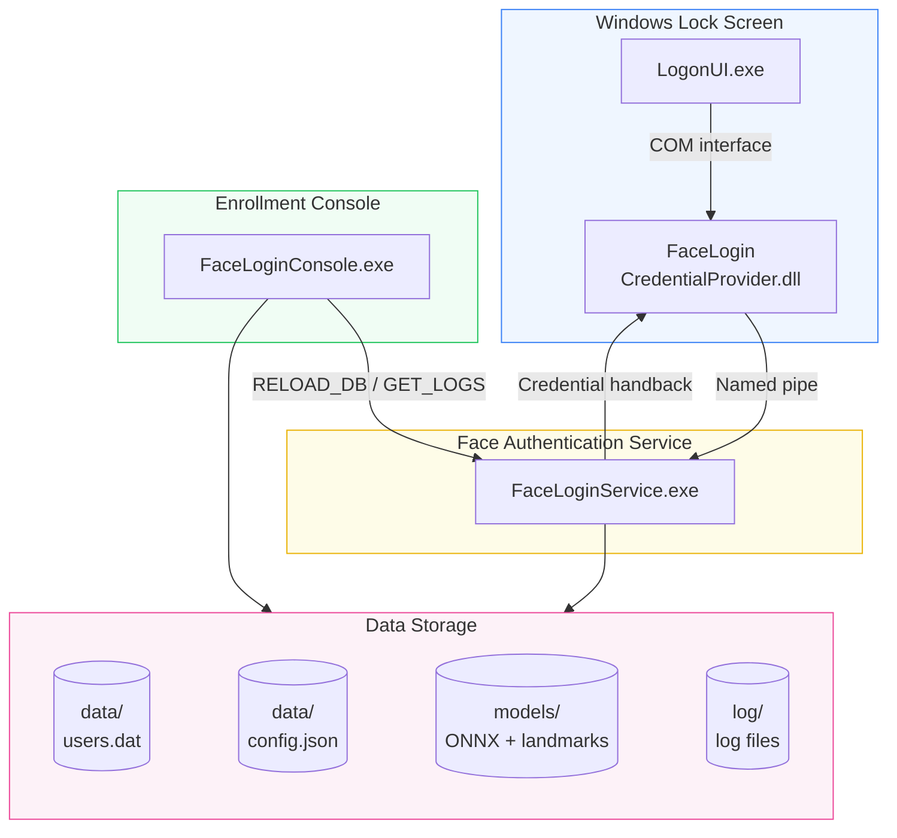

<p align="center">
  
</p>

<p align="center">
  <a href="README.md">简体中文</a> · <a href="README.ko-KR.md">한국어</a> · English
</p>

<p align="center">
  A camera-based face-recognition unlock system built on the Windows Credential Provider framework.<br>
  A "Face Login" tile integrates into the lock screen — look at the camera and unlock. Supports both local accounts and Microsoft online accounts (MSA).
</p>

<p align="center">
  <a href="LICENSE"></a>
  <a href="DEVELOPMENT.md"></a>
  <a href="DEVELOPMENT.md"></a>
  <a href="https://github.com/EthanZer0/FaceLogin/releases"></a>
</p>

---

## Features

<div align="center">

| Lock-screen face unlock | Optional liveness and pose gate | ONNX recognition |
|:---:|:---:|:---:|
| Native Windows lock-screen integration<br>Ordinary unlock starts after selecting the tile and pressing a key or mouse button | Blink / Anti-Spoof / None<br>MobileNetV2 head-pose gate | SCRFD detection + 106 landmarks<br>InsightFace 512-D embeddings |
| **Multi-account support** | **Secure storage** | **Hot configuration** |
| Local SAM + Microsoft online<br>accounts fully supported, multiple faces per account | Machine-scope DPAPI encryption<br>Pipe DACL access control | Runtime parameter changes<br>no service restart needed |

</div>

---

## System Architecture



> All cross-process communication goes through the DACL-protected named pipe `\\.\pipe\FaceLoginPipe`.

---

## Star History

<p align="center">
  <a href="https://github.com/EthanZer0/FaceLogin/stargazers">
    
  </a>
</p>

> The chart is updated daily by the independent project [StarHistory](https://github.com/EthanZer0/StarHistory)'s GitHub Actions. Data and rendering are fully self-hosted with no third-party dependencies.

---

## Quick Start

### Step 1: Install

Download `FaceLoginSetup.exe` from [Releases](https://github.com/EthanZer0/FaceLogin/releases), run it, choose an install directory, and click **Install**.

### Step 2: Enroll your face

Run `FaceLoginConsole.exe` as administrator. If Blink or Anti-Spoof liveness is enabled, follow its prompt; then enter your password and click **Save & Enroll**.

### Step 3: Unlock

Press `Win + L` to lock the screen, select the **Face Login** tile, and look at the camera. During ordinary unlock, selecting the tile arms input detection; the next keyboard key or mouse-button press starts recognition. Mouse movement alone is ignored. Cold boot starts recognition automatically by default, and can be configured to wait for a key or mouse button.

If the pose is outside the accepted range, the lock screen shows a localized instruction for turning left/right, looking up/down, or tilting your head. Recognition resumes when the pose is valid.

### Uninstall

Run the installer and switch to the **Uninstall** tab, or launch `Uninstall.exe` from the installation directory. The uninstaller stops/removes the service, unregisters the Credential Provider, and removes the installation directory and FaceLogin data. Back up any data you want to keep before uninstalling.

---

## System Requirements

| Requirement | Details |
|---|---|
| OS | Windows 10 21H2+ / Windows 11 (x64) |
| Camera | USB or built-in, 1280×720 supported |
| Runtime | WebView2 (built into Windows 11, auto-installed on Windows 10) |
| Privileges | Administrator (required for installation and enrollment) |
| Disk space | Installer ~100 MB; installed programs, runtimes, and models ~110 MB, plus user data |

---

## Security Design

| Layer | Measure |
|---|---|
| Process communication | Named pipe DACL: SYSTEM + Administrators only, remote access denied |
| Credential storage | DPAPI `CRYPTPROTECT_LOCAL_MACHINE` machine-scope encryption |
| Memory protection | Password wiped with `SecureZeroMemory` immediately after use |
| Liveness and pose | Liveness is configurable; lock-screen recognition applies a MobileNetV2 head-pose gate before matching |
| Photometric processing | Unified per-frame normalization is off by default; when enabled it adjusts only when dark/overexposed conditions require it, with hardware fallback limited to the current session |
| Match security | Euclidean distance threshold + best/second-best match ratio dual check |
| Build hardening | ASLR, DEP, CFG, 64-bit high-entropy address randomization |

---

## Project Structure

```
FaceLogin/
├── common/                 # Shared library (logging, IPC protocol, DPAPI, account info, config)
├── credential_provider/    # Windows Credential Provider COM DLL
├── face_service/           # Face recognition Windows service
├── enrollment_app/         # Face enrollment console (WebView2 GUI)
├── installer/              # Go Wails graphical installer
├── locales/                # Standalone language packs (zh-CN / ko-KR / en-US)
├── scripts/                # Build scripts and locale-pack consistency checks
└── assets/                 # Icon resources
```

See [DEVELOPMENT.md](DEVELOPMENT.md) for the detailed technical documentation.

---

## Building from Source

> Only needed when compiling yourself.

### Prerequisites

- **Visual Studio 2022** (with the C++ workload)
- **vcpkg** — dlib (image utility library: matrix/rectangle/transform), onnxruntime
- **Go 1.25+** + **Wails v2** (installer only)
- **CMake 3.20+**

### C++ Components

```powershell
# vcpkg dependencies (recognition/detection/landmarks are all ONNX; dlib provides only image utilities)
vcpkg install dlib[core] onnxruntime --triplet x64-windows

# Build (FaceLoginConsole.exe is written directly to installer/FaceLoginSetup/resources)
cmake -B build -S . -G "Visual Studio 17 2022" `
    -DCMAKE_TOOLCHAIN_FILE="$env:VCPKG_ROOT/scripts/buildsystems/vcpkg.cmake"
cmake --build build --config Release
```

### Go Installer

```powershell
cd installer/FaceLoginSetup
# Sync C++ binaries and models into resources/ first, then build the installer
.\build-installer.ps1
```

`build-installer.ps1` first builds a lightweight standalone `Uninstall.exe` without embedded installation resources, copies it into `resources/`, and then builds the full `FaceLoginSetup.exe`. Direct Wails commands remain useful for local iteration, but releases should use this script.

### Model Files

| File | Purpose | Download |
|---|---|---|
| `2d106det.onnx` | 106-point face landmark extraction | [InsightFace](https://github.com/deepinsight/insightface) |
| `det_500m.onnx` | SCRFD face detection | [InsightFace](https://github.com/deepinsight/insightface) |
| `w600k_mbf.onnx` | InsightFace face recognition | [InsightFace](https://github.com/deepinsight/insightface) |
| `minifas_quantized.onnx` | Silent anti-spoofing | [facenox/face-antispoof-onnx](https://github.com/facenox/face-antispoof-onnx) |
| `head_pose_mobilenetv2.onnx` | MobileNetV2 head-pose estimation (Yaw/Pitch/Roll) | [yakhyo/head-pose-estimation](https://github.com/yakhyo/head-pose-estimation/releases/tag/weights) |

---

## Contributing

Issues and Pull Requests are welcome!

- Code style: C++20, `/W4` warning level
- Make sure the build passes before submitting
- Discuss significant changes in an issue first

---

## Open Source License

[MIT License](LICENSE) © 2026 美国伐木工&EthanZer0

---

## Disclaimer

This software assists Windows sign-in through face recognition but **does not replace** your password. Face recognition is a convenience feature; the system always keeps password sign-in as a fallback. Do not rely on face recognition alone in environments with high security requirements.
