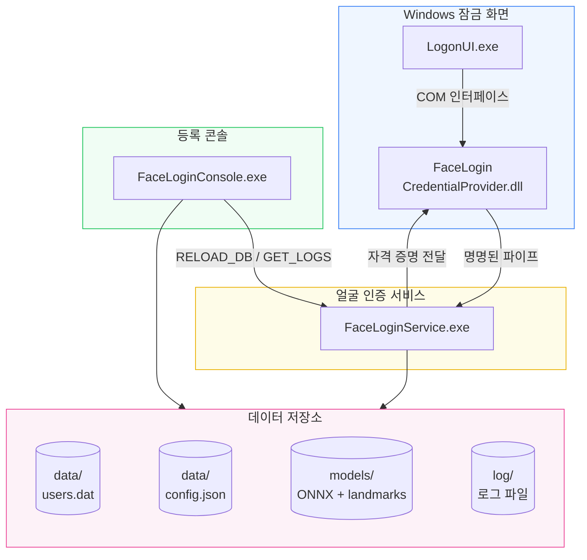

<p align="center">
  
</p>

<p align="center">
  <a href="README.md">简体中文</a> · 한국어 · <a href="README.en-US.md">English</a>
</p>

<p align="center">
  Windows Credential Provider 프레임워크를 기반으로 카메라 얼굴 인식 잠금 해제를 제공하는 시스템입니다.<br>
  잠금 화면에 ‘얼굴 로그인’ 타일을 통합하여 얼굴을 바라보는 것만으로 잠금을 해제하며, 로컬 계정과 Microsoft 온라인 계정(MSA)을 모두 지원합니다.
</p>

<p align="center">
  <a href="LICENSE"></a>
  <a href="DEVELOPMENT.md"></a>
  <a href="DEVELOPMENT.md"></a>
  <a href="https://github.com/EthanZer0/FaceLogin/releases"></a>
</p>

---

## 주요 기능

<div align="center">

| 잠금 화면 얼굴 해제 | 선택형 실재 얼굴 확인 및 자세 게이트 | ONNX 인식 |
|:---:|:---:|:---:|
| Windows 기본 잠금 화면 통합<br>일반 잠금 해제는 타일 선택 후 키 또는 마우스 버튼 입력 필요 | Blink / Anti-Spoof / None<br>MobileNetV2 머리 자세 게이트 | SCRFD 검출 + 106개 랜드마크<br>InsightFace 512차원 임베딩 |
| **다중 계정 지원** | **안전한 저장** | **실시간 설정 적용** |
| 로컬 SAM + Microsoft 온라인 계정<br>완전 지원, 계정마다 여러 얼굴 등록 가능 | 컴퓨터 범위 DPAPI 암호화<br>파이프 DACL 접근 제어 | 실행 중 인식 설정 변경<br>서비스 재시작 불필요 |

</div>

---

## 시스템 구조



> 모든 프로세스 간 통신은 DACL로 보호된 명명된 파이프 `\\.\pipe\FaceLoginPipe`를 사용합니다.

---

## Star History

<p align="center">
  <a href="https://github.com/EthanZer0/FaceLogin/stargazers">
    
  </a>
</p>

> 차트는 별도 프로젝트 [StarHistory](https://github.com/EthanZer0/StarHistory)의 GitHub Actions에서 매일 자동 갱신됩니다. 데이터와 렌더링을 모두 자체 호스팅하며 외부 서비스에 의존하지 않습니다.

---

## 빠른 시작

### 1단계: 설치

[Releases](https://github.com/EthanZer0/FaceLogin/releases)에서 `FaceLoginSetup.exe`를 내려받습니다. 실행 후 설치 폴더를 선택하고 **설치**를 누릅니다.

### 2단계: 얼굴 등록

`FaceLoginConsole.exe`를 관리자 권한으로 실행합니다. Blink 또는 Anti-Spoof 실재 얼굴 확인을 설정한 경우 안내를 따르고, 암호를 입력한 뒤 **저장하고 등록**을 누릅니다.

### 3단계: 잠금 해제

`Win + L`로 화면을 잠근 뒤 **얼굴 로그인** 타일을 선택하고 카메라를 바라봅니다. 일반 잠금 해제에서는 타일을 선택하면 입력 감지만 준비되고, 다음 키보드 키 또는 마우스 버튼 입력이 있어야 인식이 시작됩니다. 마우스 이동만으로는 시작되지 않습니다. 콜드 부팅은 기본적으로 자동 인식하며, 설정에서 키 또는 마우스 버튼 입력을 기다리도록 바꿀 수 있습니다.

머리 자세가 허용 범위를 벗어나면 좌우 회전, 위/아래 보기 또는 좌우 기울이기에 대한 안내가 표시됩니다. 자세가 허용 범위로 돌아오면 인식이 계속됩니다.

### 제거

설치 프로그램의 **제거** 탭을 사용하거나 설치 폴더의 `Uninstall.exe`를 직접 실행합니다. 제거 프로그램은 서비스를 중지·삭제하고 Credential Provider 등록을 해제한 뒤 설치 폴더와 FaceLogin 데이터를 삭제합니다. 필요한 데이터는 제거 전에 백업하세요.

---

## 시스템 요구 사항

| 요구 사항 | 세부 내용 |
|---|---|
| 운영체제 | Windows 10 21H2+ / Windows 11(x64) |
| 카메라 | USB 또는 내장 카메라, 1280×720 지원 |
| 런타임 | WebView2(Windows 11 기본 포함, Windows 10에서는 자동 설치) |
| 권한 | 관리자 권한(설치 및 등록에 필요) |
| 디스크 공간 | 설치 프로그램 약 100MB, 설치 후 프로그램·런타임·모델 약 110MB 및 사용자 데이터 |

---

## 보안 설계

| 계층 | 보호 조치 |
|---|---|
| 프로세스 통신 | 명명된 파이프 DACL: SYSTEM과 Administrators만 허용, 원격 접근 거부 |
| 자격 증명 저장 | DPAPI `CRYPTPROTECT_LOCAL_MACHINE` 컴퓨터 범위 암호화 |
| 메모리 보호 | 암호 사용 직후 `SecureZeroMemory`로 제거 |
| 실재 얼굴 및 자세 | 실재 얼굴 확인 방식은 설정 가능하며, 잠금 화면 인식 전에 MobileNetV2 머리 자세 게이트를 적용 |
| 광도 처리 | 통합 프레임별 광도 정규화는 기본적으로 꺼져 있으며, 켜면 어둡거나 과다 노출된 경우에만 조정하고 하드웨어 실패는 현재 세션에만 영향을 줌 |
| 얼굴 일치 보안 | 유클리드 거리 기준 + 최상·차상 일치 비율 이중 검증 |
| 빌드 보안 강화 | ASLR, DEP, CFG, 64비트 고엔트로피 주소 무작위화 |

---

## 프로젝트 구조

```
FaceLogin/
├── common/                 # 공용 라이브러리(로그, IPC 프로토콜, DPAPI, 계정 정보, 설정)
├── credential_provider/    # Windows Credential Provider COM DLL
├── face_service/           # 얼굴 인식 Windows 서비스
├── enrollment_app/         # 얼굴 등록 콘솔(WebView2 GUI)
├── installer/              # Go Wails 그래픽 설치 프로그램
├── locales/                # 독립 언어팩 및 번역 관리 안내
├── scripts/                # 빌드 스크립트 및 언어팩 일관성 검사
└── assets/                 # 아이콘 리소스
```

자세한 기술 문서는 [DEVELOPMENT.md](DEVELOPMENT.md)를 참고하세요.

---

## 소스에서 빌드

> 직접 컴파일할 때만 필요한 내용입니다.

### 사전 요구 사항

- **Visual Studio 2022**(C++ 워크로드 포함)
- **vcpkg** — dlib(이미지 자료 구조: matrix/rectangle/transform), onnxruntime
- **Go 1.25+** + **Wails v2**(설치 프로그램만 해당)
- **CMake 3.20+**

### C++ 구성요소

```powershell
# vcpkg 의존성(인식·검출·랜드마크는 모두 ONNX를 사용하며 dlib은 이미지 자료 구조만 제공)
vcpkg install dlib[core] onnxruntime --triplet x64-windows

# 빌드(FaceLoginConsole.exe는 installer/FaceLoginSetup/resources에 바로 출력됨)
cmake -B build -S . -G "Visual Studio 17 2022" `
    -DCMAKE_TOOLCHAIN_FILE="$env:VCPKG_ROOT/scripts/buildsystems/vcpkg.cmake"
cmake --build build --config Release
```

### Go 설치 프로그램

```powershell
cd installer/FaceLoginSetup
# C++ 산출물과 모델을 resources에 동기화한 뒤 설치 프로그램 빌드
.\build-installer.ps1
```

`build-installer.ps1`는 설치 리소스를 포함하지 않는 경량 `Uninstall.exe`를 먼저 빌드하여 `resources/`에 복사한 다음 전체 `FaceLoginSetup.exe`를 빌드합니다. 개발 중에는 직접 Wails 명령을 사용할 수 있지만, 배포용 설치 프로그램은 이 스크립트를 사용하세요.

### 모델 파일

| 파일 | 용도 | 다운로드 |
|---|---|---|
| `2d106det.onnx` | 106개 얼굴 랜드마크 추출 | [InsightFace](https://github.com/deepinsight/insightface) |
| `det_500m.onnx` | SCRFD 얼굴 검출 | [InsightFace](https://github.com/deepinsight/insightface) |
| `w600k_mbf.onnx` | InsightFace 얼굴 인식 | [InsightFace](https://github.com/deepinsight/insightface) |
| `minifas_quantized.onnx` | 수동 동작 없는 위조 방지 | [facenox/face-antispoof-onnx](https://github.com/facenox/face-antispoof-onnx) |
| `head_pose_mobilenetv2.onnx` | MobileNetV2 머리 자세 추정(Yaw/Pitch/Roll) | [yakhyo/head-pose-estimation](https://github.com/yakhyo/head-pose-estimation/releases/tag/weights) |

---

## 기여

Issue와 Pull Request를 환영합니다!

- 코드 규칙: C++20, `/W4` 경고 수준
- 제출하기 전에 빌드가 통과하는지 확인하세요.
- 큰 변경은 먼저 Issue를 만들어 논의하세요.

---

## 오픈소스 라이선스

[MIT License](LICENSE) © 2026 美国伐木工&EthanZer0

---

## 면책 조항

이 소프트웨어는 얼굴 인식을 이용해 Windows 로그인을 보조하지만 **암호를 대체할 수는 없습니다**. 얼굴 인식은 편의 기능이며 시스템은 항상 암호 로그인을 예비 수단으로 유지합니다. 보안 요구 수준이 매우 높은 환경에서는 얼굴 인식에만 의존하지 마세요.
