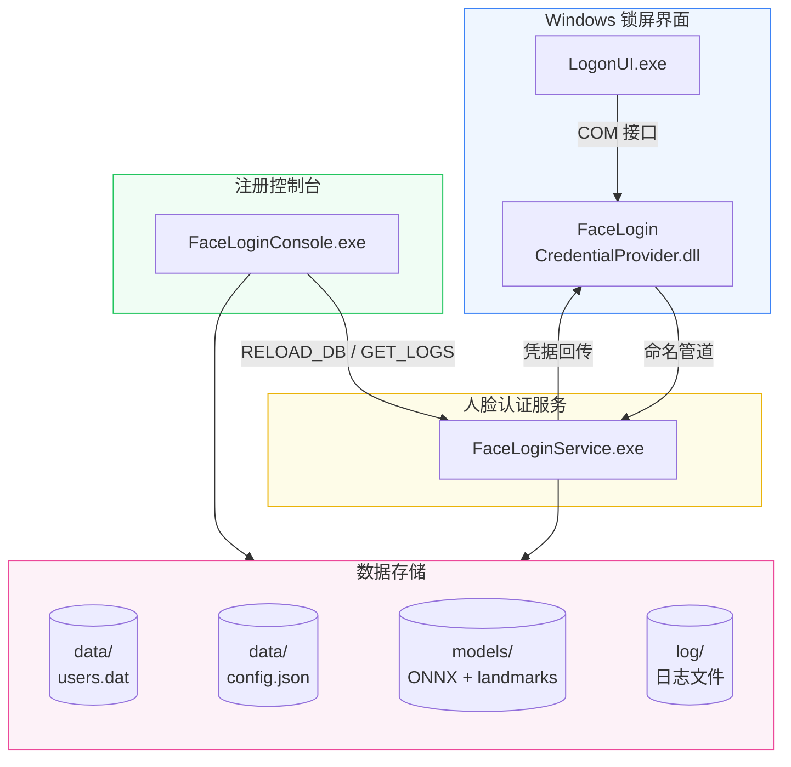

<p align="center">
  
</p>

<p align="center">
  简体中文 · <a href="README.ko-KR.md">한국어</a> · <a href="README.en-US.md">English</a>
</p>

<p align="center">
  基于 Windows Credential Provider 框架的摄像头人脸识别解锁系统。<br>
  在锁屏界面集成"人脸登录"磁贴，看一眼即可解锁 — 支持本地账户和微软在线账户 (MSA)。
</p>

<p align="center">
  <a href="LICENSE"></a>
  <a href="DEVELOPMENT.md"></a>
  <a href="DEVELOPMENT.md"></a>
  <a href="https://github.com/EthanZer0/FaceLogin/releases"></a>
</p>

---

## 特性

<div align="center">

| 锁屏人脸解锁 | 可选活体检测与姿态门控 | ONNX 识别 |
|:---:|:---:|:---:|
| Windows 原生锁屏集成<br>普通解锁需选中磁贴后按键或点击鼠标 | Blink / Anti-Spoof / None<br>MobileNetV2 头部姿态门控 | SCRFD 检测 + 106 点地标<br>InsightFace 512-D embedding |
| **多账户支持** | **安全存储** | **热配置** |
| 本地 SAM + 微软在线<br>账户全兼容，每账号可录多张人脸 | DPAPI 机器范围加密<br>管道 DACL 访问控制 | 运行时修改识别参数<br>无需重启服务 |

</div>

---

## 2.0.0 主要更新

- 录入与锁屏认证统一使用逐帧人脸处理管线：SCRFD 检测、106 点地标、可选光照归一化、姿态门控、活体与匹配使用同一帧状态。
- 新增 MobileNetV2 头部姿态模型。锁屏只接受合法姿态，并通过多语言提示具体的左右转头、抬头/低头或左右倾斜方向。
- 重构认证会话、管道读取和输入线程的生命周期；普通解锁忽略鼠标移动，迟到响应不会污染下一次认证。
- 统一光照归一化默认关闭；移除暗光增强设置、旧曝光控制器、全局硬件故障黑名单和诊断程序。
- 安装器支持原生桌面快捷方式、独立轻量 `Uninstall.exe`、自定义确认弹窗与安装目录校验；三种语言包同步维护。

完整分类更新日志见 [CHANGELOG.md](CHANGELOG.md)。

---

## 系统架构



> 所有跨进程通信通过命名管道 `\\.\pipe\FaceLoginPipe`（DACL 保护）。

---

## Star History

<p align="center">
  <a href="https://github.com/EthanZer0/FaceLogin/stargazers">
    
  </a>
</p>

> 图表由独立项目 [StarHistory](https://github.com/EthanZer0/StarHistory) 的 GitHub Actions 每日自动更新，数据与渲染完全自托管，不依赖第三方服务。

---

## 快速开始

### 第一步：安装

从 [Releases](https://github.com/EthanZer0/FaceLogin/releases) 下载 `FaceLoginSetup.exe`，运行后选择安装目录，点击 **安装**。

### 第二步：录入人脸

以管理员身份运行 `FaceLoginConsole.exe`；如果设置中启用了眨眼或反欺诈活体，按提示完成检查，然后输入密码并点击 **保存并录入**。

### 第三步：解锁

`Win + L` 锁屏后，选择“人脸登录”磁贴并注视摄像头。普通解锁需要随后产生一次键盘按键或鼠标按键输入才开始识别；鼠标移动本身不会触发识别。冷启动默认自动开始识别，也可以在设置中改为等待按键或鼠标按键。

姿态不符合要求时，界面会提示调整左右转头、抬头/低头或左右倾斜；回到合法范围后继续识别。

### 卸载

运行安装程序切换到 **卸载** 标签页，或直接运行安装目录中的 `Uninstall.exe`。卸载程序会停止并删除服务、注销凭据提供程序、删除安装目录及 FaceLogin 数据；请在卸载前备份需要保留的人脸数据。

---

## 系统要求

| 要求 | 详情 |
|---|---|
| 操作系统 | Windows 10 21H2+ / Windows 11 (x64) |
| 摄像头 | USB 或内置，支持 1280×720 |
| 运行时 | WebView2（Windows 11 内置，Win10 自动安装） |
| 权限 | 管理员权限（安装和注册需要） |
| 磁盘空间 | 安装包约 100 MB；安装后程序、运行库和模型约 110 MB，另加用户数据 |

---

## 安全设计

| 层面 | 措施 |
|---|---|
| 进程通信 | 命名管道 DACL：仅 SYSTEM + Administrators，拒绝远程 |
| 凭据存储 | DPAPI `CRYPTPROTECT_LOCAL_MACHINE` 机器范围加密 |
| 内存保护 | 密码使用后 `SecureZeroMemory` 即时擦除 |
| 活体与姿态 | 活体方法可选；锁屏识别使用 MobileNetV2 姿态门控，姿态不合法时不进入匹配 |
| 光照处理 | 统一逐帧光照归一化默认关闭；开启后仅在暗光或过曝等必要场景调整，硬件失败只影响当前会话 |
| 匹配安全 | 欧氏距离阈值 + 最佳/次佳匹配比双重校验 |
| 编译加固 | ASLR、DEP、CFG、64位高熵地址随机化 |

---

## 项目结构

```
FaceLogin/
├── common/                 # 公共库（日志、IPC协议、DPAPI、账户身份、配置）
├── credential_provider/    # Windows 凭据提供程序 COM DLL
├── face_service/           # 人脸识别 Windows 服务
├── enrollment_app/         # 人脸录入控制台（WebView2 GUI）
├── installer/              # Go Wails 图形安装程序
├── locales/                # 独立语言包（zh-CN / ko-KR / en-US）
├── scripts/                # 构建脚本与语言包一致性检查
└── assets/                 # 图标资源
```

详细技术文档请参阅 [DEVELOPMENT.md](DEVELOPMENT.md)。

---

## 从源码构建

> 仅当需要自行编译时才需关注本节。

### 前置条件

- **Visual Studio 2022**（含 C++ 工作负载）
- **vcpkg** — dlib（图像工具库：matrix/rectangle/变换）、onnxruntime
- **Go 1.25+** + **Wails v2**（仅安装程序）
- **CMake 3.20+**

### C++ 组件

```powershell
# vcpkg 依赖（识别/检测/地标全部用 ONNX，dlib 仅提供图像数据结构）
vcpkg install dlib[core] onnxruntime --triplet x64-windows

# 构建（FaceLoginConsole.exe 直接输出到 installer/FaceLoginSetup/resources/）
cmake -B build -S . -G "Visual Studio 17 2022" `
    -DCMAKE_TOOLCHAIN_FILE="$env:VCPKG_ROOT/scripts/buildsystems/vcpkg.cmake"
cmake --build build --config Release
```

### Go 安装程序

```powershell
cd installer/FaceLoginSetup
# 先将 C++ 产物和模型同步到 resources/，再构建完整安装器
.\build-installer.ps1
```

`build-installer.ps1` 会先单独构建不内嵌安装资源的轻量 `Uninstall.exe`，复制到 `resources/`，再构建完整的 `FaceLoginSetup.exe`。如只需调试前端或 Go 代码，也可以直接使用 Wails 命令，但发布安装包应使用该脚本。

### 模型文件

| 文件 | 用途 | 下载 |
|---|---|---|
| `2d106det.onnx` | 106点面部地标提取 | [InsightFace](https://github.com/deepinsight/insightface) |
| `det_500m.onnx` | SCRFD 人脸检测 | [InsightFace](https://github.com/deepinsight/insightface) |
| `w600k_mbf.onnx` | InsightFace 人脸识别 | [InsightFace](https://github.com/deepinsight/insightface) |
| `minifas_quantized.onnx` | 静默反欺诈 | [facenox/face-antispoof-onnx](https://github.com/facenox/face-antispoof-onnx) |
| `head_pose_mobilenetv2.onnx` | MobileNetV2 头部姿态估计（Yaw/Pitch/Roll） | [yakhyo/head-pose-estimation](https://github.com/yakhyo/head-pose-estimation/releases/tag/weights) |

---

## 贡献

欢迎提交 Issue 和 Pull Request！

- 代码规范：C++20、`/W4` 警告级别
- 提交前请确保构建通过
- 重大改动请先创建 Issue 讨论

---

## 开源协议

[MIT License](LICENSE) © 2026 美国伐木工&EthanZer0

---

## 免责声明

本软件通过人脸识别辅助 Windows 登录，但 **不能替代** 密码。人脸识别为便捷方式，系统始终保留密码登录作为后备。请勿在安全要求极高的环境中单独依赖人脸识别。
